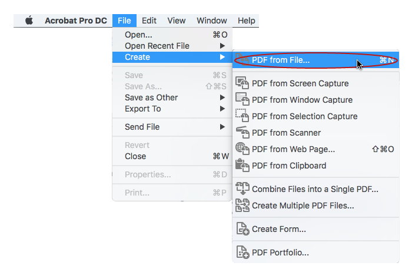
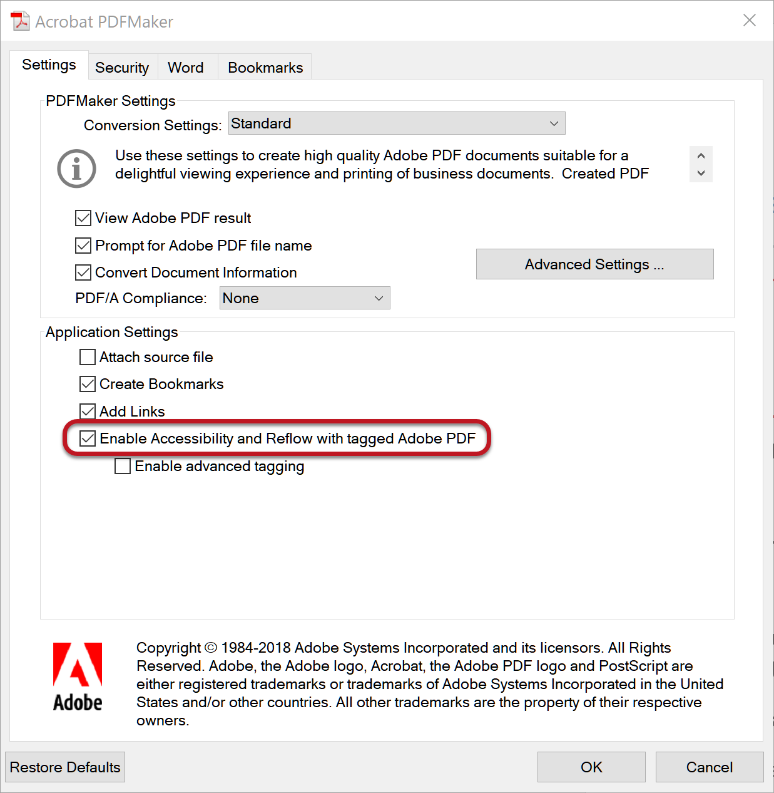
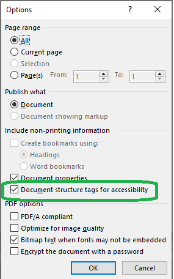

# Creating accessible galley files

This section provides an overview of how to incorporate the accessible content principles listed above into specific galley formats your journal may be using.

## How to check an MS Word document for accessibility

The MS Word Accessibility Checker scans the file for common issues that may make a file less accessible for users with disabilities.

Run the Accessibility Checker:

- Windows: File > Check for Issues > Check Accessibility
- Mac: Review > "Check Accessibility"

After running the Checker, the "Inspection Results" will display one or more of the following messages:

- **Error**: identifies content that makes a document difficult to read and understand
- **Warning**: identifies content that in most cases, makes the document difficult to understand
- **Tip**: identifies content that may not constitute an end user issue, but could be presented in a different way to optimize user experience

Clicking an item in the "Inspection Results" list will take you directly to the issue – the item will be removed from the inspection results automatically once it is addressed. You do not need to re-run the checker.

For further support, see the MS Support resource [Improve Accessibility with the Accessibility Checker](https://support.office.com/en-us/article/improve-accessibility-with-the-accessibility-checker-a16f6de0-2f39-4a2b-8bd8-5ad801426c7f#PickTab=Windows).

## Labeling your galley files

Galleys should be labeled according to the type of file being published, such as PDF or HTML (see below for information on choosing which galley formats to use). Your galley files should also follow a common naming pattern and be consistent across all publications, so that all galleys of the same type (e.g. PDF) have the same label. Screen readers will read out the type followed by the title, like “PDF: Open badges as credentials in Open Education systems: Case studies from Greece and Europe”.

Supplementary galleys should have a label that describes the content. For example, “Supplemental Data” is not very descriptive. “Regional Income Data” or “Interview Transcripts” are more descriptive.

## Which galley formats to use?

Online journals publish their articles in a variety of file types. The most common are PDF and HTML, but increasingly these additional formats are being used: ePub, MP3, and XML. As a general rule, more structured formats (those with tagging in place to indicate the features, such as headings, alt text, etc) are the most accessible. With all formats there are things you can do to maximize the accessibility and preserve the structure of the original document.

### PDF

PDF is the most common format for publishing articles, but can present a number of issues from an accessibility standpoint. One of the main issues is that a text document created with accessibility considerations in mind may lose some of these features when converted to PDF, such as tags, alt text, headings, etc. Here are the steps to follow to minimize these risks:

#### 1 - Ensure the source document is accessible

Follow the [General Principles](./principles.md) to create the source document with accessibility in mind. If you are using MS Word, use the [Accessibility Checker to validate it.](#how-to-check-an-ms-word-document-for-accessibility)

#### 2 - Convert the document into PDF

The method you choose to export your Word Document to PDF will affect the preservation of the accessibility features that you have added to your document. For additional guidance see the [WebAIM PDF Accessibility Guide - Converting Documents to PDF](https://webaim.org/techniques/acrobat/converting).

##### Preferred Method (requires Adobe Acrobat Pro)

Export your Word Document by using “Create PDF” from a file in Adobe Acrobat Pro. Open Adobe Acrobat Pro > File > Create > PDF from File > Select desired document to convert.

If you are creating a document via the Acrobat Tab in MS Office, make sure that **Enable Accessibility and Reflow with tagged Adobe PDF** is checked.

##### Next Best Method (does not require Adobe Acrobat Pro)

Save your Word Document as a PDF using the “Save As” function. This may not preserve all accessibility features, such as tagging, so it’s best to use Acrobat Pro if you have it.

On Windows:
Select **File > Save As**. Select “PDF” from the list of drop-down files.
Click “Options” and make sure **“Document structure tags for accessibility”** is checked, then save the file.

On Mac:
Open the **File** application menu and select **Save As…**
Under **File Format**, select “PDF”. Then choose the **Best for electronic distribution and accessibility** (**uses Microsoft online service**) radio button, then **Export**.

**IMPORTANT**: **never “Print to PDF”** when exporting a Word Document to PDF. A screen reader user may still be able to access the text of a PDF created in this way, but heading structure, alternative text, and any other tag structure will be lost.

#### 3 - Check a PDF document for accessibility

If you are creating a document from MS Word, start by checking accessibility using the [MS Word Accessibility Checker](./galleys.md#how-to-check-an-ms-word-document-for-accessibility).

After the document has been converted to PDF, it’s a good idea to check that accessibility features are preserved and nothing has been lost. This includes checking that tags are present and the reading order is correct for a screen reader.

This process requires Adobe Acrobat Pro and is described in detail in [WebAim’s PDF Accessibility Guide](https://webaim.org/techniques/acrobat/acrobat).

#### 4 - Remediate a PDF document

If you receive a PDF that is untagged, or where the tag structure is incomplete or incorrect, it is usually best to return to the source document, make the necessary accessibility repairs, and then re-create the PDF. If the source document is unavailable, you can use Acrobat to convert a PDF back to a Word, Excel, or PowerPoint file. Select File > Export To, then choose your desired format.

Remediating a document in PDF requires Adobe Acrobat Pro. For more details see the [WebAim’s PDF Accessibility Guide](https://webaim.org/techniques/acrobat/acrobat).

### HTML

HTML is another popular galley format used by publishers. It offers more flexibility than PDF for adjusting to different screen sizes and accommodating multimedia. It has the potential to be more accessible than PDF as long as the document follows the [general principles of creating accessible content](./principles.md#headings-structure), such as structured headings, alt text, etc.

For instructions on how to create and style HTML galleys, add multimedia content, and upload HTML galleys to OJS, see [Learning OJS 3: Production and Publication - HTML Files](/learning-ojs/en/production-publication#html-files).

### XML

XML files have the potential to be very accessible. They contain extensible markup that divides them into elements (e.g., chapters, paragraphs, tables, lists, footnotes) and have document type definition (DTD) that defines the rules for the document, describes the structural elements and attributes, and tells computer systems (such as assistive technologies) how to interpret the data. XML files can be highly structured and tagged, which provides the opportunity to add context to images, figures, etc. Semantic tagging can improve navigation and logical reading order. For example, semantic tags can tell a screen-reader in which order to read the content.

XML markup is structural and semantic, rather than having anything to do with how the text content should be presented, and the file can be processed automatically to create various formats. Many publishers use an “XML-first” publishing workflow, producing a master XML file that is used to generate HTML, PDF, EPUB, and other formats. This allows publishers to build in all accessibility features at the beginning of their workflow.

For more information on XML publishing in OJS see [Learning OJS 3: Production and Publication - XML](/learning-ojs/en/production-publication#xml-files).

The DAISY Digital Talking Book or DAISY XML is an XML-based e-book format that was developed by the DAISY Consortium as an accessible file format for people with print disabilities. It is a package of digital files that can include digital audio files, marked-up text files, synchronization files, and navigation files. Special DAISY players can play the audio, read the text using Text to Speech, and navigate through the book in an accessible way. [This tutorial](https://cynthiang.ca/2015/08/18/accessible-format-production-part-6-daisy-book/) explains how to make a DAISY Book.

### EPUB

Used commonly in eBook publishing, EPUB defines a means of representing, packaging and encoding structured and semantically enhanced Web content — including HTML5, CSS, SVG, images, and other resources — for distribution in a single-file format.

Below are some resources for accessible EPUB creation:

- [Learning OJS 3: Production and Publication - EPUB](/learning-ojs/en/production-publication#epub-files) - how to create EPUB galleys
- [EPUB - the DAISY Consortium](https://daisy.org/activities/standards/epub/) - EPUB packages and accessibility
- [Top tips for creating accessible EPUB 3 files](http://diagramcenter.org/54-9-tips-for-creating-accessible-epub-3-files.html) - tips from Diagram Center
- [EPUB Validation Process](https://kb.daisy.org/publishing/docs/epub/validation/overview.html) - EPUB accessibility checkers
