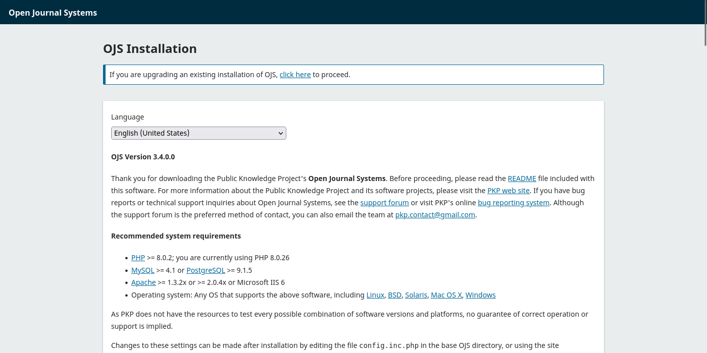
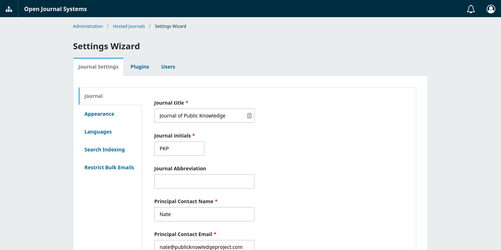
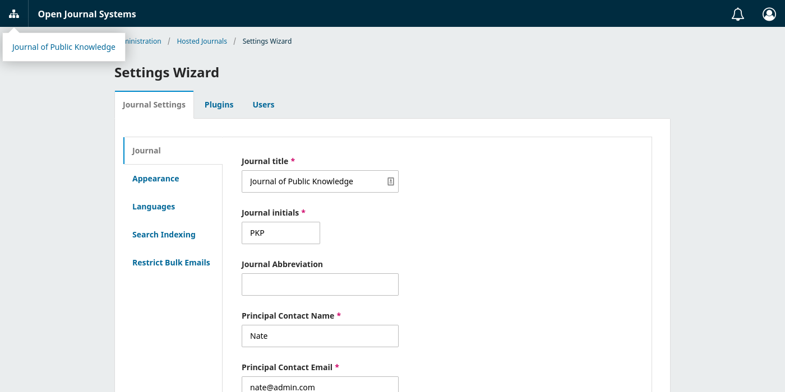

# Install

> These steps assume that you have [configured](./configure) your installation.
{:.warning}

When you install the software, it will create the database tables and file directories that it needs to run. To install the software, visit your site in a web browser.

```
https://my-example-site.com
```

You should see an installation screen like the one below.



Complete the form to finish the installation. It may take a minute to install. You should see the following success screen when it is finished.


Once you have finished the install, login with the administrator account you set up to access the admin area.

Depending on whether you installed OJS, OMP or OPS, you will be taken to a screen where you can create your first journal, press or preprint server.

- In OJS, click the **Add Journal** button.
- In OMP, click the **Add Press** button.
- In OPS, click the **Add Server** button.

Once you have created your first journal, press, or preprint server, you will be taken to it's Settings Wizard.



Click the **Users** tab to create a new user for the Journal Manager, Press Manager, or Server Manager who will be responsible for managing the journal, press or preprint server.

And you're done! You've successfully installed the software and handed it off to the editorial team.

If you want to explore the software further, click the small icon at the top to switch to your new journal, press or preprint server.



## Upgrades

It's important to keep the software up-to-date. You can learn about new software releases by following our [announcements forum](https://forum.pkp.sfu.ca/c/announcements/10) or signing up for the [developer email lists](https://lists.publicknowledgeproject.org/lists/).

When it's time to make an upgrade, use our step-by-step guide on [how to upgrade](http://localhost:4000/dev/upgrade-guide/en/).
