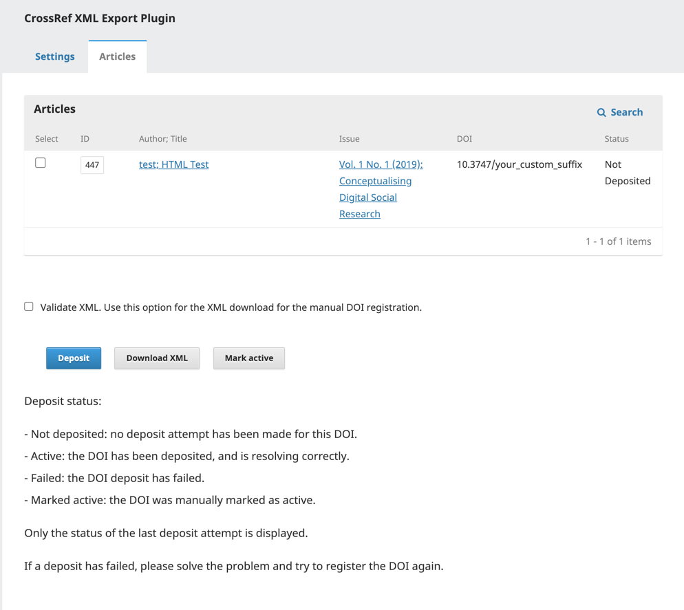

# Crossref XML Export Plugin (OJS 3.2+)

The Crossref XML Export Plugin  can deposit DOIs to Crossref for registration in a variety of ways:

- automatically, as the content is published;
- manually, from plugin interface;
- manually, via Crossref XML Export and upload via the Crossref admin tool at doi.crossref.org.

Automatic deposit can be configured to assist streamline the post-production process.

Manual deposit from the plugin interface might be used to selectively deposit content to Crossref. For example, if you’ve made minor changes to the metadata following submission. It might also be helpful if you’ve noticed that the automatic deposit is taking longer than normal to be processed.

Manual deposit using Crossref XML export and admin tool might be used if you opt to add additional metadata such as licensing information not currently being deposited through the Crossref XML plugin.

You can also register your content with Crossref entirely outside of OJS using Crossref's Web Deposit Form, though the plugin can save you having to input metadata by hand.
You can find the Crossref Plugin from your dashboard by navigating to **Tools > Import/Export > Crossref XML Export Plugin**.

This is the Crossref XML Export Plugin in OJS 3.2+:

## Setting up the Crossref Plugin

1. Fill out the name and email of the depositor. This name does not have to be the contact that orchestrated the Crossref membership. It can be a technical contact. It is merely the name that is attached to the metadata submission you deposit to Crossref. These are required fields.
2. Fill out the username and password provided to you by Crossref with your membership confirmation. These are used to register content directly from the plugin. (_Please note: if your browser automatically fills in passwords in OJS, it may populate these fields with your OJS username and password when you load this page. Make sure you don't overwrite your Crossref credentials with your OJS password, or your plugin will fail._)

## Automatic Deposits

To enable automatic deposits, simply check the box on the settings page.

OJS will deposit assigned DOIs as content in your journal is published. OJS does this at specific timed intervals. If your DOIs do not appear to be registered shortly after publication, you can wait a day to see if they make it through the OJS process and the Crossref queue. You can also check the status of your DOI by clicking the "Articles" tab at the top of the Crossref plugin settings page. You'll see an up-to-date status column on the right of the page.

## Manual Deposits

Manual deposits are always enabled in OJS 3.2+.

1. Navigate to the Crossref XML Export Plugin
2. Click the "Articles" sub-heading.
3. Click the checkbox next to the articles you want to deposit.
   - If you want to deposit specific issues, use the search function in the upper right corner of the plugin window to filter which articles will display.
4. Scroll to the bottom of the page and click the "*deposit*" button.

*Validate XML* will, when checked, confirm validation of your XML before submission to Crossref. It will inform you of potential submission issues. It is, however, not suitable for large deposits and may time out. It is best used to troubleshoot smaller deposits.

*Mark Active* will flag a DOI as submitted. Use this if you've already registered a DOI outside of the plugin and want to indicate as such.

### XML Deposit

*Export XML* will download XML generated by the plugin in the Crossref XML Schema. Simply click the check boxes next to the articles you want to deposit and then export. Once you have the XML file, you can submit it via the Crossref admin tool at [https://doi.crossref.org](https://doi.crossref.org).

## Updating DOIs

Any time you make a change to an article's metadata, **you should update the metadata associated with your DOI** registered with Crossref. Updates do not happen automatically. To update:

1. Navigate to the Crossref XML Export Plugin
2. Click the "Articles" sub-heading.
3. Click the checkbox next to the article with updated metadata.
4. Scroll to the bottom of the page and click the "deposit" button.

_Crossref does not charge to update metadata._
