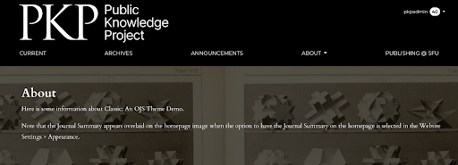
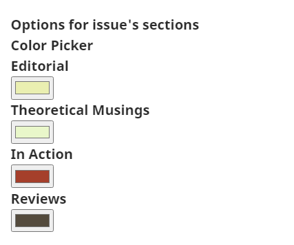

# Theme Features and Design Elements

## Introduction

You can customize your website’s look and feel by selecting one of the several available themes under Settings > Website > Appearance. For the list of available themes with description and demo pages see the [PKP Theming Guide - Themes](/pkp-theming-guide/en/themes). You can change other settings that affect the appearance of your journal under Settings > Website > Appearance. See [Learning OJS 3 - Website Settings](/learning-ojs/en/settings-website#appearance) for more details on selecting a theme and configuring appearance settings.

With some themes you can change the colours under Website Settings > Appearance. The colour settings will appear after you select the theme. To adjust it to match a specific colour, e.g., your logo, use a colour-picker tool (via browser developer tools or browser extension) and copy the hex value (looks like #1e6292) into the drop-down box. For details on how to identify elements on a page, see the section [Identifying Elements of CSS](/designing-your-journal/en/creating-stylesheet.html#identifying-elements).

In OJS you can use special plugins to add custom blocks to your site, including Twitter feeds, keyword clouds, and a list of most-read articles. [Learning OJS 3 - Website Settings](/learning-ojs/en/settings-website#appearance) explains how to do this. To learn more about the different plugins available, see [the Plugin Inventory](/plugin-inventory/en/).

The below tables can be used when selecting a theme based on the features and design elements available with each. The three tables compare image settings, colour and font options, and other features for 6 major themes available in OJS. 

Unique features relevant to specific themes are linked from the table which correspond to detailed explanations below.

Click on the name of each theme in the table headers to see a sample journal using each theme.

## Images

This table compares image settings between the various themes, including the ways that journal logos, homepage images, issue cover images, and article thumbnail images are displayed.

| Features                                                                             	| [Default Theme](https://demo.publicknowledgeproject.org/ojs3/demo/index.php/demojournal/index) 	| [Pragma](https://demo.publicknowledgeproject.org/ojs3/demo/index.php/pragma/index)       	| [Manuscript](https://demo.publicknowledgeproject.org/ojs3/demo/index.php/manuscript/index)   	| [Health Science](https://demo.publicknowledgeproject.org/ojs3/demo/index.php/health-sciences/index) 	| [Immersion](https://demo.publicknowledgeproject.org/ojs3/demo/index.php/immersion/index)     	| [Classic](https://demo.publicknowledgeproject.org/ojs3/demo/index.php/classic/index)      	|
|------------------------------------------------------------------------------	|---------------	|--------------	|--------------	|-----------------	|---------------	|--------------	|
| Journal Logo placement                                                       	| Left aligned  	| Left aligned 	| Left aligned 	| Centred         	| [Centred](#logos)      	| Left aligned 	|
| Homepage image                                                               	| Yes           	| Yes ([See more](#homepage-image))        	| Yes          	| Yes             	| Yes           	| Yes          	|
| Homepage image as Header Background                                          	| Optional      	| No           	| No           	| No              	| Yes (Default) 	| No           	|
| Issue Cover image on homepage                                                	| Yes           	| No           	| Yes          	| Yes             	| Yes           	| Yes          	|
| Article thumbnails on homepage                                               	| Yes           	| No           	| Yes          	| No              	| Yes           	| No           	|
| Issue cover image displayed on article landing page if no article thumbnail? 	| No            	| Yes          	| Yes          	| Yes             	| No            	| No           	|

## Colours and Fonts

This table compares the colour and font customization options between the various themes.

| Features                                                                             	| [Default Theme](https://demo.publicknowledgeproject.org/ojs3/demo/index.php/demojournal/index) 	| [Pragma](https://demo.publicknowledgeproject.org/ojs3/demo/index.php/pragma/index)       	| [Manuscript](https://demo.publicknowledgeproject.org/ojs3/demo/index.php/manuscript/index)   	| [Health Science](https://demo.publicknowledgeproject.org/ojs3/demo/index.php/health-sciences/index) 	| [Immersion](https://demo.publicknowledgeproject.org/ojs3/demo/index.php/immersion/index)     	| [Classic](https://demo.publicknowledgeproject.org/ojs3/demo/index.php/classic/index)      	|
|------------------------------    |---------------    |--------    |-------------    |-------------------------------------------------------------------------------------------    |-------------------------------------------------------    |----------------------------------------------------------------------------    |
| Background Colour            		 | N/A      		 | Yes   	 | No     		 | Yes (“Primary colour”: affects galley buttons, section headings, submenu background colour)     | Yes (for Journal Description & Announcement sections)     | Yes (“Primary colour”: affects footer and menu item hover background colour)     |
| Header Colour         		 | Yes      		 | N/A   	 | Yes    		 | No                                                                                   		 | No                                               		 | No                                                                    		 |
| Accent Colour         		 | No       		 | N/A   	 | Yes    		 | No                                                                                   		 | No                                               		 | No                                                                    		 |
| Font Selection          		 | Yes      		 | No		 | No     		 | No                                                                                   		 | No                                               		 | No                                                                    		 |

## Other Features

This table compares display settings between the various themes, including how journal summary information, sidebar blocks, and author affiliations will display, as well as any special features that apply to individual themes.

| Features                                                                             	| [Default Theme](https://demo.publicknowledgeproject.org/ojs3/demo/index.php/demojournal/index) 	| [Pragma](https://demo.publicknowledgeproject.org/ojs3/demo/index.php/pragma/index)       	| [Manuscript](https://demo.publicknowledgeproject.org/ojs3/demo/index.php/manuscript/index)   	| [Health Science](https://demo.publicknowledgeproject.org/ojs3/demo/index.php/health-sciences/index) 	| [Immersion](https://demo.publicknowledgeproject.org/ojs3/demo/index.php/immersion/index)     	| [Classic](https://demo.publicknowledgeproject.org/ojs3/demo/index.php/classic/index)      	|
|------------------------------    |----------------------    |------------------------------    |----------------------    |-----------------    |---------------------------------------------------------    |-----------    |
| Journal summary on homepage 	 | Optional        		 | Yes                     		 | Optional        		 | Yes        		 | Optional (setting is called “Show journal description”)     | Optional ([See more](#displaying-the-journal-summary-on-the-homepage))     |
| Placement of sidebar blocks 	 | Sidebar         		 | Footer                  		 | Sidebar         		 | Footer     		 | Footer                                             		 | Footer   	 |
| Author Affiliation      		 | Displayed by default     | Togglable               		 | Displayed by default     | Togglable  		 | Togglable                                          		 | Togglable     |
| Other features          		 |                 		 | Monochromatic homepage image     |                 		 |            		 | [Colour-blocking](#colour-blocking), Show section description             		 |      		 |
| Accessible ([See more](#note-about-accessibility))             		 | Yes             		 | Untested                		 | Untested        		 | Untested   		 | Untested                                           		 | Untested 	 |

## Unique Features for Specific Themes

### Classic Theme

The [Classic Theme](/pkp-theming-guide/en/theme-classic) should bring to mind classics and scholarship. It uses a serif typeface (Cardo) designed for “classicists, biblical scholars, medievalists, and linguists,” and was inspired by the work of Renaissance printer Aldus Manutius.

#### Displaying the Journal Summary on the Homepage

As with other themes, the Journal Summary can optionally be displayed on the journal homepage. The setting for this looks slightly different with this theme. In the Website Settings under Appearance > Theme, use the Journal Summary setting to select whether or not the Journal Summary will be shown on the journal’s homepage. 

Note that the Journal Summary will appear overlaid on the homepage image, as shown in the screenshot below.

### Immersion Theme

[Immersion](/pkp-theming-guide/en/theme-immersion.html) emphasises the reading experience and offers bold design options such as a full-width header image and per-section colour choices. The serif typeface, Spectral, conveys a strong artistic personality and is paired with the crisp functionality of Roboto, a sans-serif typeface.

#### Logos

If you plan to use a logo with the Immersion theme, be aware that the logo will be placed directly over the Homepage Image. Consider using a transparent logo and be sure to maintain colour contrast between your logo and the Homepage Image. A logo with a large resolution will display as-is, so you may need to adjust the sizing before uploading the logo in the journal.

#### Colour-Blocking

The Immersion theme makes use of colour-blocking to define the different sections of each page. The background colours of the Announcements section and Journal Description section (when enabled to display on the home page) can be configured under Website > Appearance > Theme. 

Additionally, background colours can be selected for each section of an issue by navigating to the Issue Data tab. 

#### Browse by Section

Immersion allows you to display a description for each section of the journal on the home page and each issue page when the Browse By Section plugin is activated and configured. Section descriptions can be added from Journal Settings > Section by clicking the Edit button of the relevant section and entering a description in the Section Archive Description field.

### Pragma Theme

[Pragma](https://github.com/pkp/pragma/blob/main/README.md) is a minimalist theme inspired by early periodicals’ tables of contents, with a customisable single-colour palette and an embedded PDF galley. 

#### Homepage Image

Note that the homepage image will display in monochromatic by default, so it’s a good idea to keep this in mind when preparing a homepage image to upload to this theme.

The homepage image will only appear on the site when there is either:

- Text entered into the Journal Summary field
- An announcement published on the homepage

### Bootstrap Theme

The community Bootstrap3 theme differs from other themes in that it is designed to be a base for developers who are familiar with the HTML, CSS and JavaScript techniques used in the framework, not a final product. **The Bootstrap theme is not recommended for those looking for a theme that looks polished without customization.** Those with technical expertise wishing to use Bootstrap as a base for their own child theme should consult the [Bootstrap3 Theme section of the Theming Guide](/pkp-theming-guide/en/theme-bootstrap3). 

However, if you would still like to use Bootstrap as-is, some basic information about the theme is provided below.

### Variants/Swatches

There are many alternate themes or “swatches” of the Bootstrap theme that keep the basic elements of the Default Bootstrap theme while changing colours and typography. For example, the ‘Journal’ variant of the Bootstrap theme uses a coral accent colour and a bold sans-serif font for headers and the navigation bar, while ‘Sandstone’ uses a green accent colour for links and features a dark grey navigation bar.

## Note About Accessibility

PKP is committed to ensuring our platforms are as accessible as possible for all users. To achieve this, the OJS Default Theme was developed by PKP for OJS 3.3 and higher, and was audited for accessibility barriers. Please read the [Default Theme accessibility statement](/accessibility-statement/en/) for more information.

Our other themes contain accessible features, but have not been audited and may not be fully accessible at this time.
