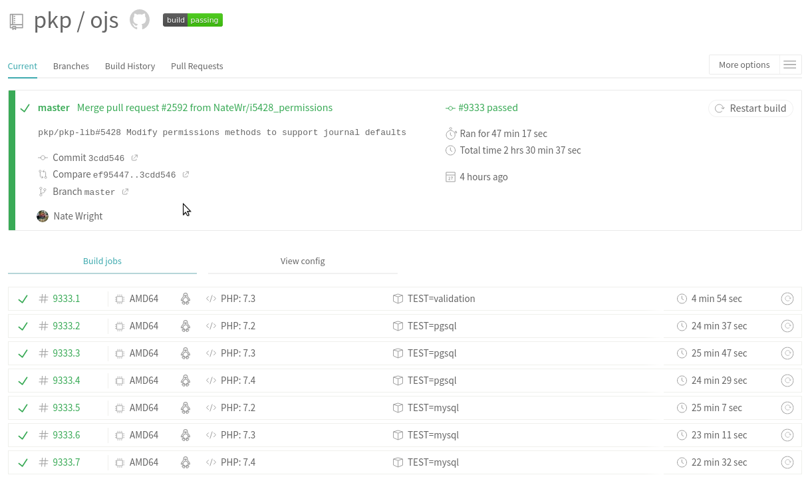
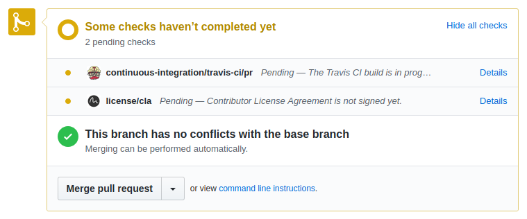

# Continuous Integration

We use [Travis CI](https://travis-ci.com) for Continuous Integration (CI) testing. Integration and unit tests are run against every commit and pull request to help catch regressions before they are released.

CI tests are configured to run the tests against multiple PHP versions and databases. The configuration details are stored in the `.travis.yml` file in the application's root directory.



View the tests for [OJS](https://travis-ci.com/pkp/ojs/), [OMP](https://travis-ci.com/pkp/omp/) and [OPS](https://travis-ci.com/pkp/ops/).

## Tests for pull requests

Travis will run tests against every pull request to OJS or OMP. The tests are listed in the checks at the bottom of the pull request.



Click the **Details** link beside the Travis tests to watch the tests as they run and see which tests have passed or failed. All tests must pass before a pull request will be merged.

### Prepare pull requests for testing

A single change to an application may involve pull requests to more than one repository. For example, a change that impacts `pkp-lib` and `ojs` will require two pull requests.

Travis must be able to locate the correct repository and branch for the `pkp-lib` submodule in order to run the tests against the correct code. To do this, an extra commit with a special commit message, `Submodule update ##<username>/<branch>##`,  is added to the application repository.

The example below will instruct Travis to clone the `ojs` and `pkp-lib` repositories owned by `NateWr` and check out the `i123_example` branch.

```
cd path/to/ojs
git add lib/pkp
git commit -m "Submodule update ##NateWr/i123_example##"
```

For the tests to run correctly against this commit, the changes must be in a branch named `i123_example` in _both repositories_.

> In most cases, your work will be spread across multiple repositories. Use the same branch name across each repository to keep track of them. For example, work on issue 5421 might be in a branch named `i5421_function` in `ojs` and `pkp-lib`.
{:.tip}

Sometimes changes are made to `pkp-lib` that do not require changes to OJS or OMP. In such cases, the tests must still be run. Create a branch in OJS or OMP, add the submodule commit, and create a pull request to OJS or OMP to run the tests.

---

Learn how to [write tests](./writing-tests).