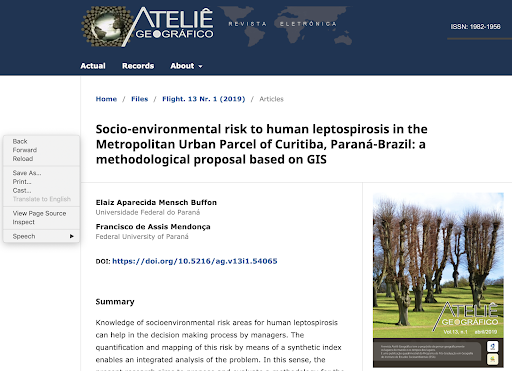
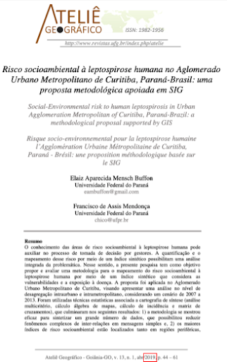
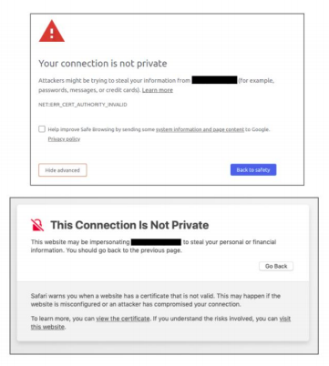

# Google Scholar Indexing

> Contributors: Kate Shuttleworth, Emily Zheng, Monica Westin, Roger Gillis, Patricia Manghais

## Introduction

This guide provides guidance around the indexing of Open Journal Systems (OJS) in Google Scholar. It is written largely for an audience of journal managers as well as systems administrators - those who are responsible for the installation, upgrading and general maintenance of the system. We have tried to suggest the sections which are most applicable to these two audiences.

This guide focuses on Google Scholar indexing of OJS sites. Some of this information is applicable to OMP and OPS sites, but Google Scholar interaction with these sites has not been researched.

## Overview of Google Scholar Indexing

Google Scholar is a popular scholarly indexing engine that crawls the web looking for scholarly publications: articles, books, reports, theses, conference proceedings, preprints, among others. Google scholar identifies scholarly content, determines each item's bibliographic metadata, and groups different online versions of an item together with this metadata in search results.

There is no need to register your journal with Google Scholar. Google Scholar will eventually find and automatically crawl the site. If you notice that your journal is not appearing in Google Scholar, there may be some issues that need to be addressed, see the [common OJS indexing problems and suggested fixes](#troubleshooting-for-journal-managers-and-editors) below.


Google Scholar relies on two key pieces of information in order to do its indexing:

1. A way to crawl all the Uniform Resource Locators (URLs) - or essentially links - for articles, either via a crawler-friendly browse (usually set up by default for OJS instances), or a sitemap.

2. Bibliographic information from articles in the form of machine-readable metadata tags ("metatags"). These metatags are derived from the information you add to the forms in OJS to describe your journal, issues, and submissions.

Bibliographic metatags indicate to Google Scholar the specific metadata for an article (e.g. title, author, publication date, etc.).

Example set of metatags from [Google Scholar inclusion guidelines](https://scholar.google.com/intl/en/scholar/inclusion.html#indexing):

```html
<meta name="citation_title" content="The testis isoform of the phosphorylase kinase catalytic subunit (PhK-T) plays a critical role in regulation of glycogen mobilization in developing lung">
<meta name="citation_author" content="Liu, Li">
<meta name="citation_author" content="Rannels, Stephen R.">
<meta name="citation_author" content="Falconieri, Mary">
<meta name="citation_author" content="Phillips, Karen S.">
<meta name="citation_author" content="Wolpert, Ellen B.">
<meta name="citation_author" content="Weaver, Timothy E.">
<meta name="citation_publication_date" content="1996/05/17">
<meta name="citation_journal_title" content="Journal of Biological Chemistry">
<meta name="citation_volume" content="271">
<meta name="citation_issue" content="20">
<meta name="citation_firstpage" content="11761">
<meta name="citation_lastpage" content="11766">
<meta name="citation_pdf_url" content="http://www.example.com/content/271/20/11761.full.pdf">
```

The `<meta name="citation_pdf_url"/>` tells the indexing system which file to associate with this metadata, and provides a direct URL to the article galley.

You can review the metatags for one of your articles by going to the landing page for the article, then viewing the HTML source. Usually you can do this by right clicking on the page and selecting "View Page Source", "Inspect Element", "Developer Tools", or using a keyboard command, depending on which browser you use.



Once viewing the source code of your article page, you can search the HTML source for "citation_" to view metatags. This process can be used to test and troubleshoot many of the OJS indexing errors described in this guide.


## Troubleshooting for Journal Managers and Editors

If you notice that Google Scholar has not indexed or ceased indexing your journal, it could be due to inconsistencies between the journal's metadata and the Galley files. Metadata in the Tags & Galley should match precisely. Some common discrepancies include:

- Incorrect publication dates listed in metatags

- Mixing up multiple languages or scripts in metatags

- Language of metadata (especially title and abstract) in different language than the language of the article full text

- Author name formatting discrepancies between metadata and galley (e.g. Given Name and Family Name format and capitalization).

- Authors listed in a different order in metatags than the author order in the gallery

Follow the steps below to check for consistency in your journal's metadata. If the metadata seems to be correct but your journal's articles do not appear in Google Scholar search results, it may take some time before the changes show up in the Google Scholar site, as once Google Scholar has indexed an article, any changes will not be reflected until Google Scholar makes changes to its' index (which occurs twice yearly). Should the changes still not appear, contact your site administrator for further support for further troubleshooting (see the ['Troubleshooting for Site Administrators' section](#troubleshooting-for-site-administrators)). To learn more about metadata practices, see [the Better Practices in Journal Metadata guide](/metadata-practices/en/).

### Check for consistency in the publication date

The publication metatag should match the date of formal publication for the issue, as well as the publication date listed on the article PDF. If one of these dates is incorrect you can change it on the journal site (in the Issue Data settings) or on the article PDF.





There is a known bug for different versions of OJS below that cause incorrect dates to be listed in the metatags. If you are using any version of 3.0.x or 2.4.x and have widespread date errors in the metatags across your site, this bug is a likely cause.

To test for this problem, review the HTML source for your articles to view the date metatag for articles across your journals. Compare these dates with the publication dates listed in the PDFs, as well as the publication date for the issues in which these articles appear.

If the problem is widespread across your OJS site, and you are currently using one of the OJS versions listed here, there is a patch that has been developed specifically to fix this problem. This patch will ensure that only the publication date is being used in the date metatag.

Patches for supported versions of OJS include:

- [OJS 3.0.1 and 3.0.2](https://github.com/pkp/ojs/commit/9105b7ebc397f3647d500d62d30654b56a4f1e60.diff)

- [OJS 3.0.0](https://github.com/asmecher/ojs/commit/c46a9d7a0873ba21ab7fec1cd1453cae215f9a3f.diff)

- [OJS 2.4.x](https://github.com/pkp/ojs/commit/6cf0078cff0556231696cf9979377381d18d721d.diff)

[More information about the code patch can be found here.](https://github.com/pkp/pkp-lib/issues/2739)

Contact your site administrator if you believe that your journal may be affected by this bug.

### Use only one language in each metadata tag, and don't reproduce duplicate metadata in different languages/scripts across multiple metatags

Another common error for OJS journals occurs when multiple languages or scripts are combined in the metatags for a single article, resulting in mixed bibliographic information. This causes confusion both for the Scholar indexing system and for researchers who may, for example, click on a Scholar search result that seems to be an article written in a familiar language -- and end up on a PDF they can't read. Avoid duplicating this information in different languages or scripts within a single field.

Example including the translated version of the title in title metatags:

```html
<meta name="citation_title" content="War and Peace == Война и мир" />
```

Example listing authors in native script/language of home institution when it is not the language in which the article was written:

```html
<meta name="citation_author" content="Толстой, Лев Николаевич " />
```

```html
<meta name="citation_author" content="Tolstoy, Lev Nikolayevich "/>
```

### Use the full-text language in the metadata tags

The language of the abstract should match the language of the metatags, such as the title metatag. Using English as the default language for metatags, regardless of the language of the article, will also cause problems for indexing. It also results in missed citations, because articles that cite another article will likely use the language of the full-text for the citation. Missing citations means articles won’t be ranked as they should be in Scholar search results - and both of these result in unhappy authors.


The fix for both of these issues is to use the language of the full text in the PDF as a guide for the language to use in entering the metadata in the fields in OJS.

#### Adding multilingual metadata in OJS 3.2

In OJS 3.2, it is possible to enable multiple languages for your journal and add metadata in those languages in separate fields. This avoids the indexing issues that can result from inconsistencies with the metadata language not matching the language of the article text, or of combining multiple languages in the same metadata field. Note that you should still ensure that the [primary language for the submission](/learning-ojs/en/authoring#step-1) matches the language of the full article text, and that metadata is entered in the language of the full article text, regardless of whether or not additional language metadata is included.

> If an article is published in multiple languages, Google Scholar will only index the primary language.
{:.notice}

See the Learning OJS 3.2 guide under [Website settings - Languages](/learning-ojs/en/settings-website#languages) for details on enabling multiple languages for your journal. See Production and Publication - [Multilingual Submissions](/learning-ojs/en/production-publication#multilingual-submissions) for details on adding metadata in multiple languages.

### Ensure that authors’ names are formatted consistently

Common formatting errors could include incorrect/inconsistent “first name, last name: format, incomplete names, spelling errors or capitalization, and discrepancies between metatags and published PDF.

In the red metatags below, you can see a few different examples of common author name errors, all of which will break indexing in Google Scholar. In the first metatag, notice that the author’s first name and last name have been inverted. In the second, only part of the author’s name has been entered. And in the last, a lower case spelling has been used for the author’s name.


To troubleshoot and fix these errors, you will want to compare the names in the citation_author metatags with how it appears in the PDF. If there are discrepancies, make the change to the metatags in the article metadata within your journal to match the PDF. Remember to look out for formatting and capitalization.

## Troubleshooting for Site Administrators

If you notice that Google Scholar has not indexed or ceased indexing your journal, there are a few potential causes. Google Scholar will stop indexing a journal if:

- There are high numbers of metadata errors (see the [Troubleshooting for Journal Managers and Editors section](#troubleshooting-for-journal-managers-and-editors) for details)
- The metatags are missing entirely (a known bug for upgrades to some versions of OJS)
- The HTTPS certificate is invalid or expired
- There are frequent site downtimes
- The OJS site has been hacked

Below, we will detail how to recognize & fix these common problems.

### Metatags no longer included after OJS upgrade

There is a known bug for upgrades to some versions of OJS: OJS 2.x to OJS 3.0.1, 3.0.2, 3.1.0, and 3.1.1 that does create issues for journals in relation to Google Scholar.

In these cases, the Google Scholar plugin that creates metatags for OJS journals is disabled during the upgrade, even if it was enabled on the previous version.

If your OJS site has upgraded to any version of OJS listed above, it’s a good idea to check if your journals have been affected by this issue. The best way to check is to search for the “citation_title” metatag in the HTML source for a few articles in each journal that upgraded. If there is no title metatag, you have likely been affected by this disabled plugin issue.

There are a few different ways to fix this issue, depending on how many OJS journals you publish. If the collection of journals on your OJS site is small enough that you are able to make a simple manual adjustment for each journal, that is probably the easiest solution. To enable the Google Scholar plugin manually on a journal by journal basis, start by logging into the administrator dashboard for your journal. From the “plugins” tab, find the list of “generic plugins” and check the “Google Scholar Indexing Plugin” checkbox. Be sure to save your settings. Repeat for every affected journal.

Otherwise, if you have so many journals on your OJS site that making a change for each individual journal will take too much time, you can use [an SQL command to adjust your journals database all at once](https://github.com/pkp/ojs/blob/stable-3_1_2/dbscripts/xml/upgrade/3.1.2_update.xml#L41..L42).

Finally, you can upgrade to OJS version 3.1.2 and newer, where the fix for this bug has been built in. This is the recommended solution by both PKP and Google Scholar (see “Best practices for OJS journals” above).

### Secure Socket Layer (SSL) certificate errors

When the https version of a site returns errors due to an invalid certificate, the indexing system is blocked from crawling the site and is forced to remove it from the Scholar index.

To test, open an article in several different browsers (Chrome, Safari, etc). If you see warnings that the connection is not private, contact your SSL certificate provider to fix. If possible, ask them to set up automated renewals to avoid future expirations.



### Site downtimes

Frequent site downtimes will trigger Google Scholar to cease indexing a journal.

Work with your host to minimize downtime for scheduled maintenance, and manage anticipated traffic to prevent traffic overload.

During site migrations, the best practice is to keep the old site functional and live while the new site is being developed, to avoid interruptions in access for both researchers and the indexing system. When the new site is ready to go live, first put the article-level redirects in place, then change the DNS lookup to the new server. (See also “[Set up article-level redirects](#set-up-article-level-redirects)”)

When migrating an OJS journal, try to keep the old site functional while you develop your new site. This avoids interruptions in access for both researchers and indexing systems. When the new site is ready to go live, first put the article-level redirects in place, then change the DNS lookup to the new server.

### Site hacks

Hacked OJS sites are used for commercial spamming. Being hacked may not be immediately obvious to editors and journal managers.

Google Scholar tries to identify hacked sites, and cease to index them.

If you suspect that your OJS site might be hacked:

- Emulate the Google crawler (to see what it “sees”) by setting your user-agent to Googlebot: `curl -A Googlebot URL_ON_YOUR_SITE`
  - Check a broad sample of randomly selected articles to see if they return a different page from what you see in the browser, or redirect to another site.
- Alert your hosting provider. They should be able to analyze and fix underlying security issues.
- Alert [the PKP community](https://forum.pkp.sfu.ca) forum and share your solutions

Best practice for OJS is to ensure that you are running the newest version and to monitor the PKP community forum and the PKP website for new releases and upgrade if possible. If you are the victim of spammers, you can use the “merge users” tool either in the User administration interface or [through the command line](/admin-guide/en/securing-your-system#cleaning-lots-of-users) to remove these accounts in bulk. We also recommend [enabling reCaptcha in your OJS configuration file](/admin-guide/en/securing-your-system#captcharecaptcha) to reduce the number of spam accounts created in your installation.

## Best practices for OJS journal indexing

### Avoid customized URL structures

The Google Scholar indexing system has been trained to recognize the standard OJS URL structure. While OJS allows customization of URL paths, customized urls makes it harder for the crawler to identify OJS journals. The structure should be:

https://SITENAME.COM/index.php/JOURNALABBREVIATION/article/view/SUBMISSION#

For example:

http://seer.unipampa.edu.br/index.php/agropampa/article/view/23142

We recommend against customizing OJS’s url paths, which will make it slower and more difficult for Google Scholar crawlers to index the site.

### Set up article-level redirects

When a journal site moves or items are renumbered, this will result in article-level HTTP needing to be redirected.

If your journal will be migrating or has migrated, or articles have been renumbered or given new identifiers, it will be important to minimize broken links. You will need to set up redirects at the article level, from the previous article URL to the new article URL; it is not sufficient to simply redirect the old articles to the new homepage URL.

These redirects would need to be permanent HTTP 301s and not HTTP 302s. For more information on the differences between the two, see [this guide to 301 and 302 redirects.](https://www.searchenginejournal.com/301-vs-302-redirects-seo/299843/)

## Google Scholar indexing guidelines and resources for OJS

1. [Google Scholar inclusion & troubleshooting guidelines](https://scholar.google.com/intl/en/scholar/inclusion.html#indexing)

2. [“Indexing Repositories: Pitfalls & Best Practices” presentation from 2015 Open Repositories conference](https://www.or2015.net/wp-content/uploads/2015/06/or-2015-anurag-google-scholar.pdf) (targeted to repositories, but has good general guidelines for both Scholar & web indexing)

3. [PKP Community Forum](https://forum.pkp.sfu.ca/)
