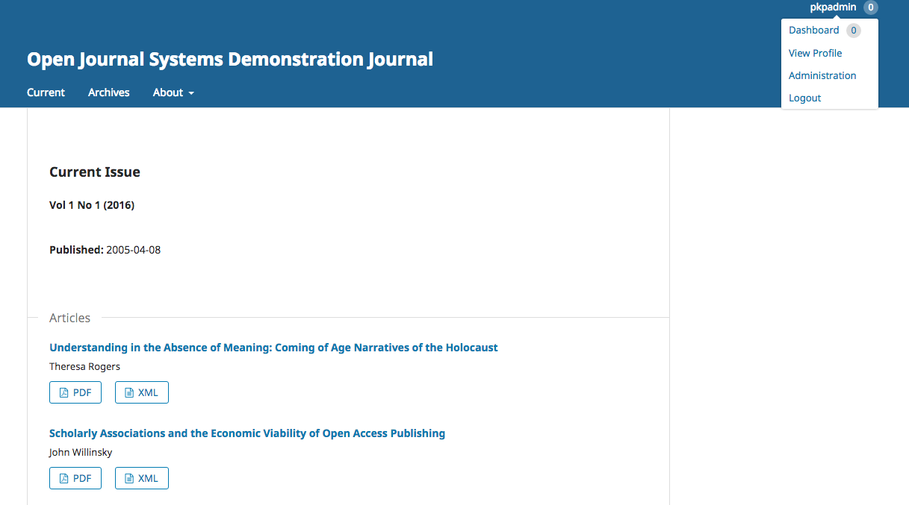
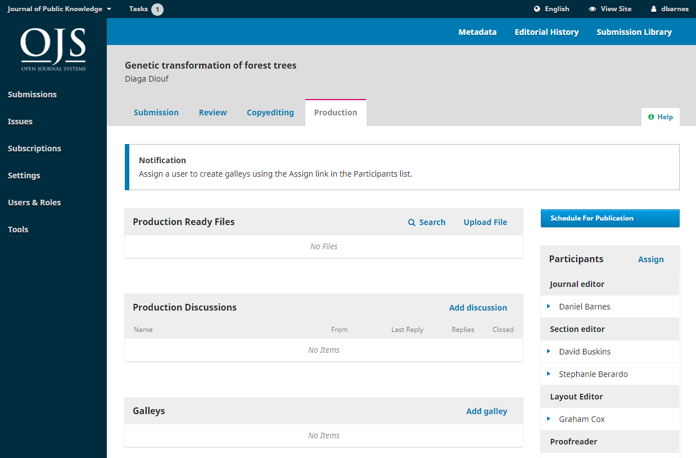

# Capítulo 1: Introducción

Open Journal Systems (OJS) es una solución de código abierto para la gestión y publicación de revistas académicas en línea. OJS es un sistema de gestión y publicación de revistas altamente flexible, operado por un editor, que puede descargarse gratuitamente e instalarse en un servidor web local.

Ha sido diseñado para reducir el tiempo y la energía dedicados a las tareas administrativas y de gestión asociadas con la edición de una revista, al tiempo que mejora el mantenimiento de registros y la eficiencia de los procesos editoriales. Su objetivo es mejorar la calidad académica y pública de la publicación de revistas a través de una serie de innovaciones, entre las que se incluyen la mejora de la experiencia del lector, la transparencia de las políticas de las revistas y la mejora de la indización.

Este libro cubre la versión 3.1 de OJS, publicada en octubre de 2017, y presenta mejoras significativas con respecto a las versiones anteriores del software. Esperamos que le resulte útil para sus proyectos editoriales.

## Antecedentes

_OJS es un sistema de gestión y publicación de revistas y sitios web._ OJS cubre todos los aspectos de la publicación de revistas en línea, desde el establecimiento de un sitio web de la revista hasta las tareas operativas tales como el proceso de envío del autor, la revisión por pares, la edición, la publicación, el archivo y la indexación de la revista. OJS también ayuda a manejar los aspectos personales de la organización de una revista, incluyendo el seguimiento del trabajo de editores, revisores y autores, notificando a los lectores y ayudando con la correspondencia.

_OJS es flexible y escalable._ Una sola instalación de OJS puede soportar la operación de una o varias revistas. Cada revista tiene su propio URL único, así como su propio aspecto. OJS puede permitir que un solo editor gestione todos los aspectos de una revista y el sitio web de la revista, o bien, OJS dará soporte a un equipo internacional de editores con diversas responsabilidades para las múltiples secciones de una revista.

_OJS apoya el principio de ampliar el acceso._ Este sistema no sólo pretende ayudar a la publicación de revistas, sino también demostrar cómo se pueden reducir los costes de la publicación de revistas hasta el punto de que proporcionar a los lectores un "acceso abierto" a los contenidos de la revista se convierta en una opción viable. Los argumentos a favor del acceso abierto se exponen en una amplia serie de artículos derivados de este proyecto que están disponibles gratuitamente en el sitio web del Proyecto Investigación > Publicaciones en la página web del Proyecto de Conocimiento Público.

_Los orígenes de OJS._ El sistema fue lanzado por primera vez en 2001 como una iniciativa de investigación y desarrollo en la Universidad de Columbia Británica, con el apoyo del Consejo de Investigación en Ciencias Sociales y Humanidades de Canadá, la Fundación Max Bell, la Pacific Press Endowment y la Fundación MacArthur. En la actualidad, la Biblioteca de la Universidad Simon Fraser supervisa su desarrollo continuo. Para obtener más información, visite el sitio web del Proyecto de Conocimiento Público.

## Características de OJS

OJS incluye las siguientes características:

1. OJS se instala localmente y se controla localmente
2. Los editores configuran requisitos, secciones, proceso de revisión, etc.
3. Envío en línea, revisión doble ciego y administración de todo el contenido
4. Amplia indexación del contenido
5. Interfaz de lectura con capacidad de respuesta y temática
6. Notificación por correo electrónico para los lectores
7. Soporte para cargos de procesamiento de artículos, suscripciones y pagos en línea
8. Completo soporte de ayuda en línea sensible al contexto
9. Soporte multilingüe

## Novedades en OJS 3.1

El OJS 3.1 se basa en los cambios introducidos con el OJS 3, y es significativamente diferente de su predecesor, el OJS 2. Incluye mejoras y nuevas características desarrolladas a partir de los comentarios de la comunidad, extensas pruebas de usabilidad y nuevas capacidades de diseño de software.

## Interfaz de Lector

Por defecto, Open Journal Systems se instala con una interfaz de usuario muy simple y funcional. Esto incluye un encabezado superior, una barra de navegación, bloques de navegación a la derecha y un bloque de contenido principal en el centro de la página.

La siguiente imagen es una captura de pantalla de un Índice de la revista de Demostración de OJS.

Puedes ver en la captura de pantalla que las funciones de usuario ahora existen en el menú de tu perfil en la parte superior derecha de la pantalla. Esto aleja el contenido de gestión en OJS 3.x de la vista general del usuario. La información de la barra lateral está claramente desglosada, así como la barra de navegación superior con menús plegables para las funciones "Acerca de". Al igual que OJS 2, cada artículo tiene un título enlazado para ver los metadatos y resúmenes de los objetos, y ahora las galerías están claramente etiquetadas debajo de los títulos con logotipos más claros.

## Interfaz Editorial

_alias El Tablero_

OJS 3.x ahora tiene una interfaz separada cada vez que inicie sesión en el sistema editorial. Esto no sólo facilita la personalización de la interfaz de lectura, sino que también proporciona una experiencia consistente a los usuarios de OJS de diferentes revistas.

La interfaz editorial se conoce como su **panel de control** y consta de los siguientes elementos:

1. **Barra de navegación superior:** A la izquierda, encontrará el nombre de la revista con la que está trabajando actualmente (por ejemplo, Journal of Public Knowledge). Si está inscrito en más de una revista en esta instalación de OJS, puede utilizarla para cambiar de revista. Junto a esto están sus Tareas (artículos que necesitan atención inmediata). A la derecha, puede cambiar de idioma si la revista es multilingüe, ver la interfaz de lectura o hacer clic en su nombre de usuario para ver su perfil o cerrar la sesión.

2. **Panel del menú izquierdo:** Estas son las secciones principales del panel, incluyendo los envíos, la administración de números, la administración de suscripciones (si está ejecutando una revista con suscripciones), la configuración, la administración de usuarios y funciones, y las herramientas. Los usuarios con menos permisos (por ejemplo, Autores, Revisores, Copiadores, etc.) verán menos enlaces aquí.

3. **Barra de navegación azul:**** Estas opciones de menú son específicas para las diferentes secciones del flujo de trabajo editorial. Los metadatos, el historial editorial y la biblioteca de envíos forman parte del registro de envíos que se muestra a continuación.

4. **Panel principal:** En el panel principal verá el área de trabajo actual. En la imagen de arriba, usted está viendo un registro de sumisión en la etapa de Producción.

5. **Submenús del Panel Principal:** Dentro del Panel Principal, a menudo verá pestañas que le permiten ver información diferente sobre el contenido en el que se está trabajando. En este ejemplo, el registro de envío se divide en cuatro secciones (Envío, Revisión, Edición, Producción). Fíjese en la pestaña Ayuda a la derecha, que proporciona ayuda sensible al contexto para la página que está viendo actualmente.
 
6. **Panel derecho:** Desde aquí, puede ver los botones de acción, como Schedule for Publication. Diferentes páginas tienen diferentes botones de acción. Debajo de los botones de acción se encuentra la tabla Participantes, que enumera a todos los participantes (excepto a los Revisores) involucrados en el envío.

## Contribuciones de la Comunidad

El equipo de OJS fomenta las contribuciones de la comunidad de desarrolladores. Si usted está interesado en involucrarse en hacer que OJS sea aún mejor, le damos la bienvenida a su participación.

Excelentes ejemplos de contribuciones de la comunidad incluyen la amplia gama de idiomas en los que OJS está disponible; y plugins de terceros publicados en el foro de la comunidad y en la página archivada del foro.

También agradecemos las contribuciones a las pruebas de software y a los informes de errores.

## Soporte

Se puede acceder a un foro comunitario y a un sistema de reporte de problemas técnicos a través del sitio web de PKP.

Si tiene preguntas sobre un sitio de revista en particular, como los requisitos de envío, póngase en contacto directamente con esa revista, utilizando la información de contacto que aparece en la página **Acerca** de la revista.

