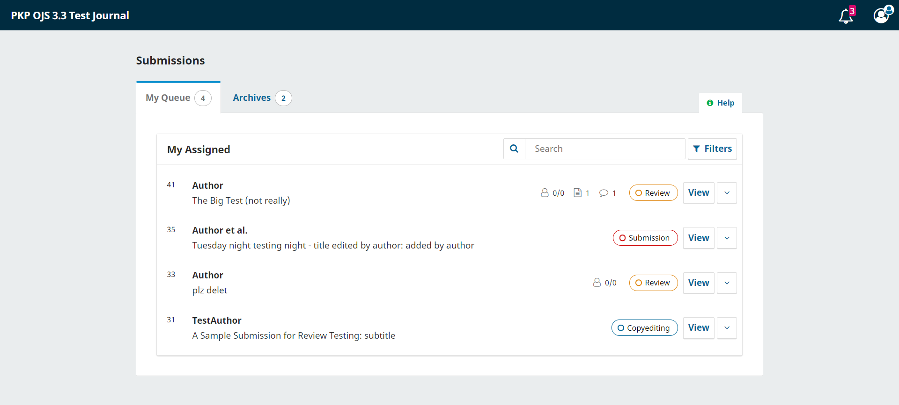
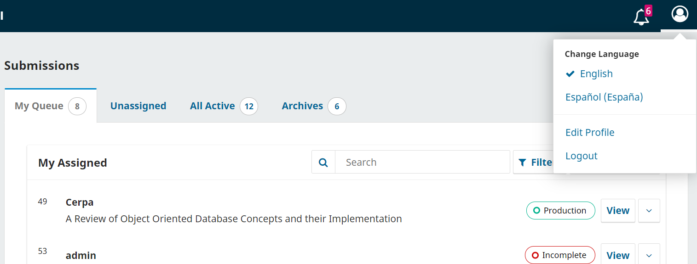

# Sobre o Open Journal Systems (OJS) {#about-ojs}

Open Journal Systems \(OJS\) é uma solução de código aberto para o gerenciamento e publicação de periódicos acadêmicos online. OJS é um sistema de gerenciamento e publicação operado por editor, altamente flexível, que pode ser baixado gratuitamente e instalado em um servidor web local.

Foi projetado para reduzir o tempo e a energia dedicados às tarefas rotineiras e gerenciais associadas à edição de um periódico, ao mesmo tempo, enquanto melhora a manutenção de registo e a eficiência dos processos editoriais. Procura aumentar a qualidade acadêmica e de publicação dos periódicos por meio de uma série de inovações, incluindo o aprimoramento da experiência do leitor, tornando mais transparentes as políticas das revistas, e melhorando a indexação.

Este guia cobre o OJS versão 3.3, liberado em fevereiro de 2021, e apresenta melhorias significativas em relação às versões anteriores do software. Nós esperamos que você ache útil para os seus projetos de publicação.

## Antecedentes

Este vídeo da Escola do PKP explica o plano de fundo de PKP e de OJS. Para assistir a outros vídeos desta série, visite[PKP’s YouTube channel](https://www.youtube.com/playlist?list=PLg358gdRUrDVTXpuGXiMgETgnIouWoWaY).



*OJS é um sistema de periódicos/gerenciamento de site/sistema de publicação*. OJS cobre todos os aspectos da publicação de um periódico on-line, desde a implementação do site da revista até as tarefas operacionais, como o processo de submissão do artigo pelo autor, a revisão por pares, edição, publicação, arquivamento e indexação do periódico. O OJS também ajuda a gerenciar os aspectos pessoais da organização de uma revista, incluindo o acompanhamento do trabalho dos editores, pareceristas e autores, notificando leitores e auxiliando com a correspondência.

*OJS é flexível e escalável*. Uma única instalação do OJS pode suportar a operação de uma ou mais revistas. Cada periódico tem seu próprio endereço URL, assim como a sua própria aparência. O OJS pode permitir que um único editor gerencie todos os tópicos da revista e seu website, ou o OJS vai apoiar um grupo de editores internacionais com diversas responsabilidades para as múltiplas seções de uma revista.

*OJS apoia o princípio de acesso estendido*. Este sistema tem a intenção de não apenas auxiliar a publicação da revista, mas de demonstrar como os custos de publicação de periódicos podem ser reduzidos ao ponto em que prover leitores com o “acesso aberto” aos conteúdos do periódico torna-se uma opção viável. O caso do “Acesso Aberto” é explicado por uma ampla variedade de artigos apresentados neste projeto e disponíveis gratuitamente por trás de Pesquisa > Publicações no website [Public Knowledge Project](https://pkp.sfu.ca).

*A origem do OJS*. O sistema foi liberado pela primeira vez em 2001, como uma pesquisa e uma iniciativa de desenvolvimento na Universidade da Colúmbia Britânica (University of British Columbia) com o financiamento do Conselho Canadense de Pesquisa em Ciências Sociais e Humanidades, a Max Bell Foundation, o Pacific Press Endowment e a MacArthur Foundation. A continuidade do desenvolvimento está sob os cuidados da Simon Fraser University Library. Para mais informações, acesse o site do [Public Knowledge Project](https://pkp.sfu.ca).

## Funcionalidades do OJS

Visite o nosso site para saber mais sobre o [Open Journal Systems](https://pkp.sfu.ca/software/ojs) e o que ele tem para oferecer em todo o fluxo de trabalho entre o pesquisador e o leitor, de submissão e revisão por pares até a produção e distribuição.

## Instalação e Atualização

OJS é fácil de instalar e configurar. No entanto, executar um serviço da web requer um administrador de sistemas que saiba como implantar aplicativos web. Nosso Guia do Administrador fornece instruções completas sobre como [baixar, instalar e configurar o OJS](/admin-guide/pt).

> Se você não tem a experiência, equipe ou desejo de instalar e gerenciar OJS por conta própria, [Serviços de publicação do PKP](https://pkp.sfu.ca/hosting-services) fornecem soluções de hospedagem completas para cada orçamento. 
> 
> {:.tip}

## O que há de novo no OJS 3.3 {#whats-new}

OJS 3.3 tem um menu simplificado de painel de navegação e novas funcionalidades relacionadas à gestão da submissão, comunicação com os usuários e acessibilidade. Esta seção vai destacar as principais mudanças para que você saiba o que esperar quando atualizar para a versão OJS 3.3. Você também pode assistir [ao vídeo (em inglês) que apresenta novas funcionalidades do OJS 3.3](https://youtu.be/3D_hS4Bd-Y8), criado pelo [Serviço de Publicação do PKP](https://pkpservices.sfu.ca).

Muitas dessas mudanças são aplicáveis também ao Open Monograph Press (OMP) e Open Preprint Systems (OPS).

Caso esteja atualizando da versão OJS 2 e queira assistir a uma visão geral sobre as mudanças do OJS 3.X, acesse [O que tem de novo no OJS 3, na versão anterior deste guia](https://docs.pkp.sfu.ca/learning-ojs/3.1/en/introduction#whats-new-in-ojs-3), e o guia PKP [Atualizando do OJS 2 para OJS 3](https://docs.pkp.sfu.ca/upgrading-ojs-2-to-3/). Por favor, note que você precisará atualizar primeiramente da versão OJS 2 para a OJS 3.2 e, em seguida, para a versão OJS 3.3.

Para um resumo de mudanças no OJS 3.3 que são relevantes para desenvolvedores e desenvolvimento, por favor veja as [Notas de lançamento para o OJS/OMP/OPS v3.3](https://docs. pkp. sfu. ca/dev/release-notebooks/en/3.3-release-notebook)

### Interface do Painel de Controle e Menus de Navegação

Há algumas mudanças na interface do painel e menus de navegação para os usuários logados no OJS 3.3.

Gerentes, editores, pareceristas, autores e outros que loguem na revista podem notar uma mudança no menu principal de navegação no lado esquerdo da tela. Na versão 3.3, somente usuários com papéis que têm acesso ao menu de configuração (gerentes e editores da revista) verão o menu de navegação do lado esquerdo. Há, também, links para menus adicionais para Edições, Anúncios e Pagamentos, e alguns dos links do menu foram movidos.

Usuários em outros papéis não verão o menu, porque eles só podem acessar a parte de Submissões do menu.

Um usuário agora pode acessar seu perfil de usuário e selecionar um idioma em periódicos multilíngues clicando no ícone do usuário no canto superior direito.

O link do painel para acesso público da página inicial do site mudou. O Gerente ou Editor da revista agora pode ver o site público clicando no nome do periódico que aparece no símbolo do mapa do site, no canto esquerdo da página. Para instalações com várias revistas, pode-se clicar no mapa do site, no canto esquerdo da página, que a lista de instalação aparece e pode-se selecionar o site público da revista.

### Fluxo Editorial

#### Carregando arquivos de submissão

Durante o processo de submissão, Autores podem carregar múltiplos arquivos de uma vez, bem como arrastar e soltar arquivos. Os Autores são mais requisitados no processo de inserir conteúdos dos metadados como a descrição, licença e outros. Tais informações podem ser inseridas durante o fluxo, uma vez que o assistente de carga segue em uso. Pode-se encontrar mais informações no [Capítulo para Autores](./authoring#step-2).

<figure class="video_container">
  <video controls="true" allowfullscreen="true">
    <source src="./assets/learning-ojs3.3-upload-submission-files.mp4" type="video/mp4">
  </video>
  <figcaption>Um vídeo curto que demonstra como arquivos podem ser carregados no OJS 3.3.</figcaption>
</figure>

#### Filtros de Submissão

Todas as submissões ativas e arquivadas podem agora ser filtradas pelo número e editor. Somente gerentes de revista podem utilizar o filtro para editor. Para mais instruções, acesse o [Capítulo do Fluxo Editorial](./editorial-workflow#submission-dashboard).

#### Reverter uma decisão declinada

Uma nova ação editorial permite aos editores reverterem uma decisão declinada nos estágios de submissão e revisão. Depois que uma decisão de rejeitar é revertida, a submissão é restaurada ao estágio anterior e a rodada de avaliação se ativa. Para obter mais instruções, acesse o [Capítulo do Fluxo Editorial](./editorial-workflow#submission-dashboard).

#### Excluir apenas submissão rejeitadas

Somente submissões rejeitadas podem ser excluídas da lista de submissões. Para mais instruções, acesse o [Capítulo do Fluxo Editorial](./editorial-workflow#archives).

#### Terminologia do tipo de avaliação

Nas versões anteriores do OJS, os tipos de avaliação eram “Duplo-cega”, “Cega” e “Aberta”. No OJS 3.3, porém, eles foram alterados para “Avaliador Anônimo / Autor Anônimo”, “Avaliador Anônimo / Autor Revelado” e “Aberta”.

#### Categoria exibida na página do artigo

As categorias atribuídas a um artigo agora aparecem na página inicial do artigo. Podem-se encontrar mais informações no capítulo [Configurações da Revista](./journal-setup#categories).

#### Desativar submissões

Os gerentes e editores de periódicos podem definir as configurações do fluxo de trabalho para desativar todas submissões de uma revista. Tal recurso pode ser usado por periódicos que não aceitam novos conteúdos. Podem-se encontrar mais instruções no capítulo [Configurações da Revista](./journal-setup#categories).

### Gerenciamento e comunicação de usuários

#### Exportar usuários

Agora existe uma ferramenta de exportação, disponível em Ferramentas -> Importar/Exportar, que pode ser usada para exportar usuários para um arquivo CSV. Tal recurso pode ser usado na importação de usuários para serviços de correspondência de terceiros. Podem-se encontrar mais instruções no capítulo de [Usuários e Papéis](./users-and-roles#email-users).

#### Notificar usuários

O OJS 3.3 dispõe de um recurso muito solicitado para notificar, ou enviar uma mensagem, a todos os usuários em um papel. Veja o capítulo [Usuários e Papéis](./users-and-roles#email-users) para obter mais informações.

#### Filtrar modelos de e-mail por estágio de fluxo de trabalho

Ao gerenciar e editar modelos de e-mail em Configurações > Fluxo de trabalho > E-mails, os gerentes e editores de periódicos podem filtrar os modelos de e-mail por estágio do fluxo de trabalho. Podem-se encontrar mais instruções no capítulo de [Configurações do Fluxo de trabalho](./settings-workflow#filters).

### Acessibilidade

Em 2019, o OJS foi adotado para acessibilidade de pessoas com deficiência e uso de tecnologia assistiva. Todas as mudanças recomendadas pela auditoria foram implementadas no OJS 3.3, incluindo um tema-padrão acessível e blocos personalizados que exigem títulos. Podem-se encontrar mais informações sobre os blocos personalizados no capítulo de [Configurações do Website](./settings-website#custom-block-plugin).

### Para revistas multilíngues

OJS 3.3 tem um número de novos recursos que aprimoram o uso para jornais que trabalham e/ou publicam em múltiplas línguas.

#### Formatos de data e hora

Os formatos de data e hora agora podem ser especificados para cada revista e local/língua. Mais instruções constam no capítulo de [Configurações do website](./settings-website#date-and-time).

#### Idiomas da direita para a esquerda

Há um maior apoio a línguas lidas da direita para a esquerda, como o árabe, farsi e hebraico, na riqueza do editor de texto que aparece em muitos campos de formulário no OJS.

#### URLs remotos
Itens de menu de navegação com URLs remotos agora podem ter URLs remotos diferentes para cada idioma.

## Contribuições da Comunidade

A equipe do OJS encoraja contribuições da comunidade de desenvolvedores. Se você está interessado em se envolver em melhorar ainda mais o OJS, nós damos as boas-vindas à sua participação.

Excelentes exemplos de contribuições de comunidade incluem a vasta variedade de linguagens disponíveis em OJS; e plugins de terceiros publicados no [fórum da comunidade](https://forum.pkp.sfu.ca/) e na página do fórum arquivada.

Também aceitamos testes de software e contribuições de relatos de bugs.

## Suporte

O PKP oferece os seguintes recursos de suporte grátis para OJS:

* [PKP Docs Hub](https://docs.pkp.sfu.ca/): Guias do usuário, documentação do desenvolvedor e dicas de publicação para todos os nossos softwares. Também inclui links para vídeos desenvolvidos pela comunidade.
* [Fórum da comunidade PKP](https://forum.pkp.sfu.ca/): um fórum de discussão on-line onde você pode fazer e responder perguntas, além de compartilhar ideias.
* [PKP School](https://pkpschool.sfu.ca/): uma coleção de cursos on-line, abertos e individualizados, desenvolvidos por especialistas do PKP em inglês e espanhol. Inclui tutoriais em vídeo sobre como configurar sua revista, o fluxo de trabalho editorial no OJS 3 e como se tornar um editor.

Há também um link de "ajuda", no canto superior direito de cada página do OJS, OMP e OPS, onde se pode encontrar informações sobre a página atual e suas funções.

Para perguntas sobre o site de um periódico específico, como requisitos de submissão, deve-se entrar em contato com o periódico usando as informações de contato listadas na página **Sobre** do periódico.
