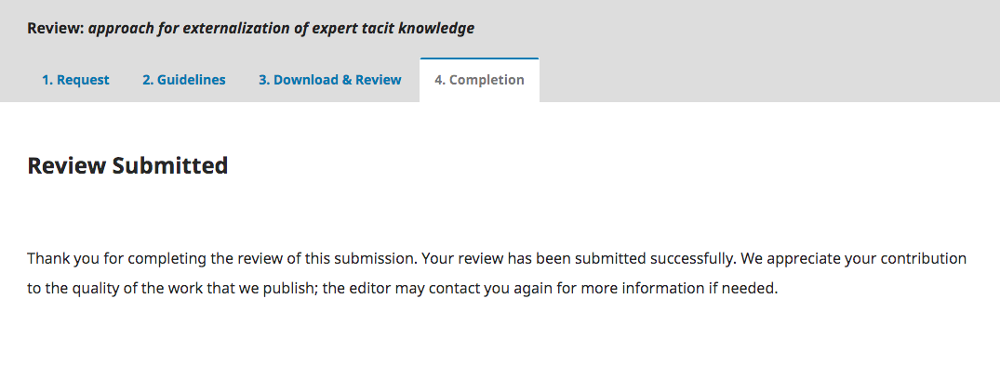

# Revisando


Este vídeo da PKP School explica como revisar um artigo no OJS. Para assistir a outros vídeos desta série, visite [PKP’s YouTube channel](https://www.youtube.com/playlist?list=PLg358gdRUrDUKJbWtr4bgy133_jwoiqoF).

Como revisor, você ficará sabendo da solicitação de revisão por e-mail ou verificando seu painel:

Na lista "Minhas Submissões Designadas", encontram-se o título e o link "Revisão". Observe a falta de qualquer informação sobre o autor neste processo de revisão por pares do Revisor Anônimo/Autor Anônimo.

Selecione o link "Revisão" e você será direcionado à primeira etapa de revisão no registro de envio, que é muito mais limitado do que a visão do Editor e não contém informações do Autor

Essa primeira etapa é constituída das seguintes seções:

**Solicitação de revisão**: fornece algum texto, convidando você a trabalhar como avaliador.

**Título do artigo**: mostra o título do artigo.

**Resumo**: apresenta o texto do resumo.

Mais abaixo na tela, você encontrará informações adicionais.

Por meio do link **Ver todos os detalhes da submissão**, uma janela com informações adicionais é aberta. Nela, constam todos os metadados que não são do Autor:

Observe que nenhum desses campos pode ser editado pelo Avaliador e são fornecidos apenas para ajudá-lo a realizar uma revisão completa.

Feche esta janela e mova mais para baixo a tela. A partir daqui, você pode ver o cronograma de revisão, incluindo todas as datas de vencimento relevantes.

A partir desse ponto, você pode recusar ou aceitar a revisão. Se recusar, será excluído do processo. Se aceitar, passará à etapa 2 de revisão, na qual poderá ler todas as diretrizes para avaliadores fornecidas pela revista.

Clique em **Continuar** para ir à etapa 3. Nessa etapa, você pode baixar uma cópia dos arquivos de revisão e inserir seus comentários de revisão. A primeira janela é para comentários ao Editor e ao Autor; a segunda janela é apenas para o Editor.

Depois de ler o artigo e adicionar seus comentários, role a página para baixo para, opcionalmente, transferir uma cópia marcada do arquivo de revisão (lembre-se de retirar qualquer identificação pessoal do arquivo antes de carregá-lo).

Em seguida, você deve fazer suas recomendações usando o menu suspenso.

Suas escolhas incluem:

**Aceitar**: o manuscrito está pronto para ir à edição.

**Correções obrigatórias**: o texto requer pequenas alterações que podem ser revisadas e aceitas pelo editor.

**Reenviar para Revisão**: requer grandes alterações e outra etapa de revisão por pares.

**Submeter a outra revista**: o manuscrito não parece se ajustar ao foco e escopo do periódico.

**Rejeitar**: o manuscrito tem muitos pontos fracos para ser aceito.

**Ver comentários**: se nenhuma das recomendações acima fizerem sentido, é possível deixar um comentário para o editor, detalhando suas preocupações.

Por fim, clique no botão "Enviar Avaliação" para concluir a tarefa. Você será solicitado a confirmar.

Clique em OK. Você será direcionado para a tela de confirmação final, que agradecerá pelo seu trabalho

É isso! A revisão está completa.
