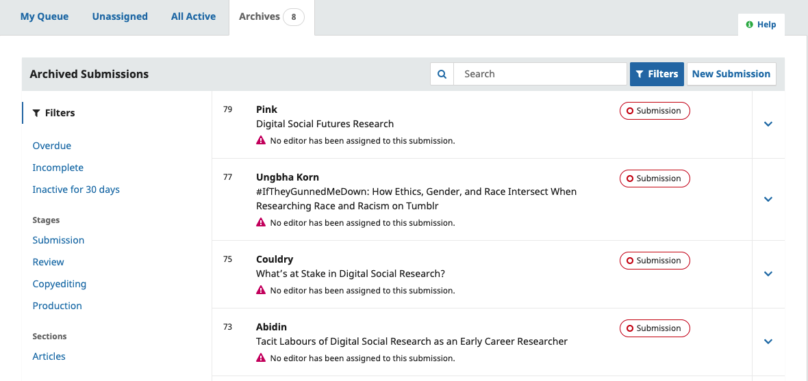
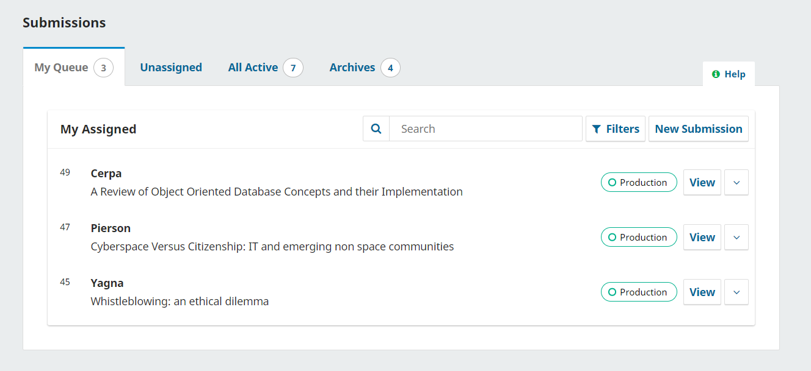
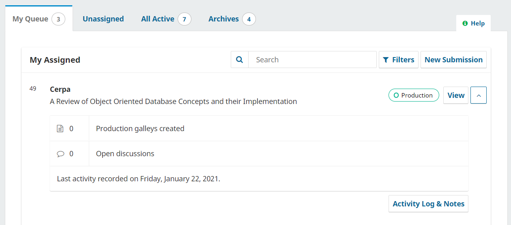
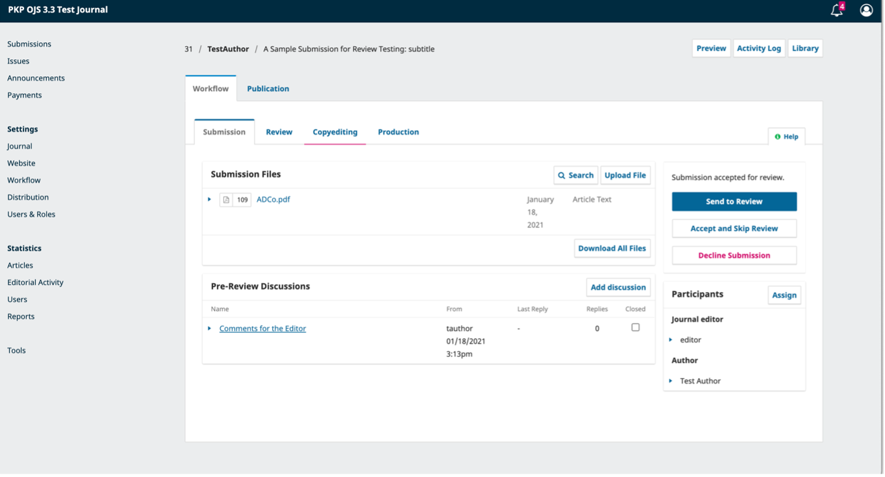
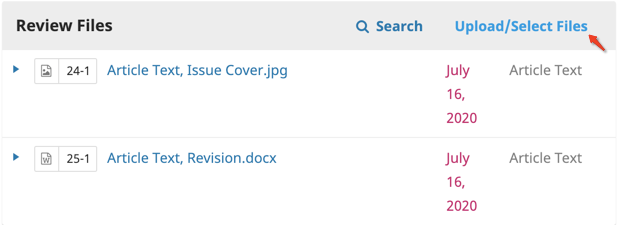
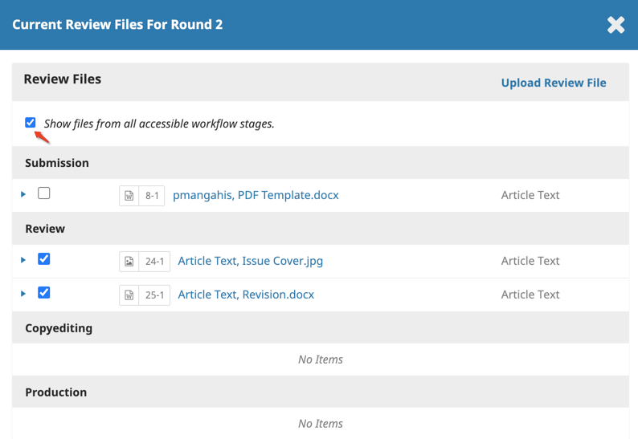
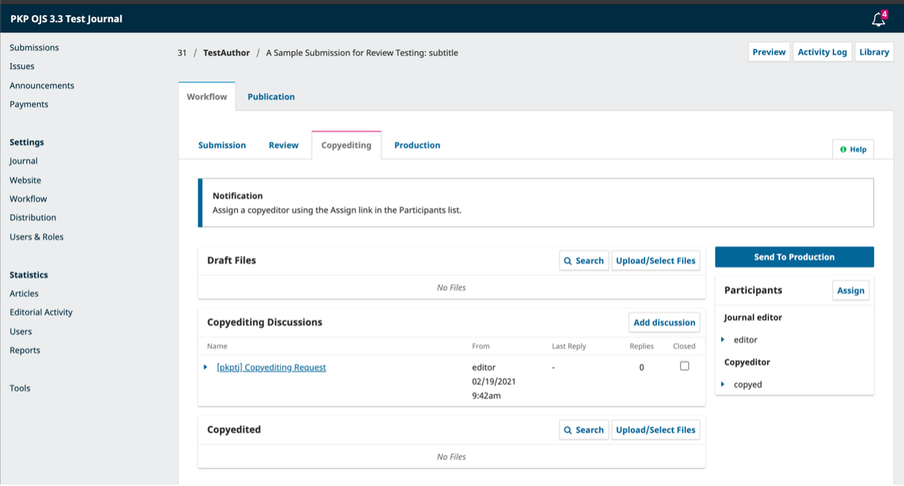
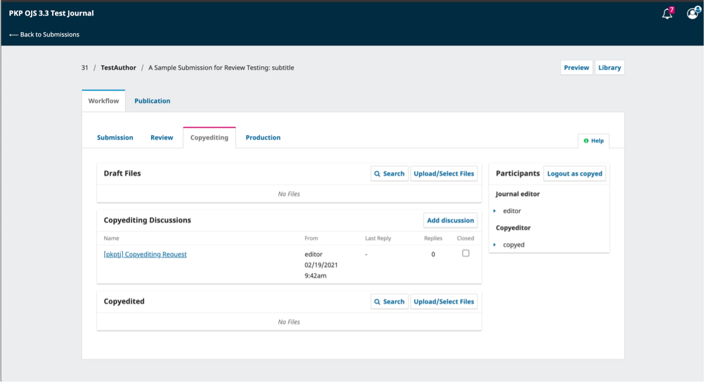
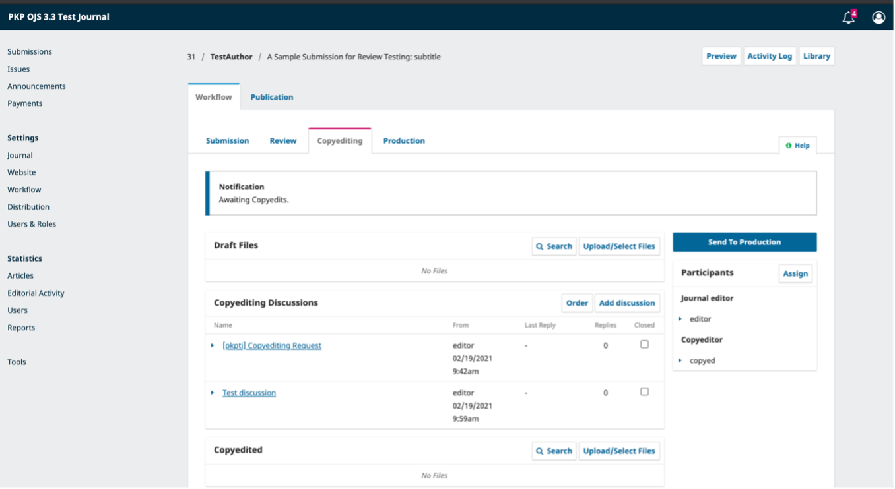

# Editorial Workflow

In this chapter, you will follow a submission throughout the workflow, from first submission to final publication.



This PKP School video provides an overview of the editorial workflow in OJS 3.3. To watch other videos in this series, visit [PKP’s YouTube channel](https://www.youtube.com/playlist?list=PLg358gdRUrDUKJbWtr4bgy133_jwoiqoF).

The workflow is divided into 4 stages:

**Submission**: This is where new submissions land while being assigned to Section Editors and considered for moving into the Review stage.

Some submissions are clearly inappropriate and never make it beyond this stage.



This PKP School video explains the steps the Editor takes to assign a new submission to a Section Editor. To watch other videos in this series, visit [PKP’s YouTube channel](https://www.youtube.com/playlist?list=PLg358gdRUrDUKJbWtr4bgy133_jwoiqoF).

**Review**: This is where the peer review happens, as well as any revisions required by the author.

Some submission will not pass review and end here. Those that are accepted move to the next stage.

**Copyediting**: Accepted articles move to this stage, where they are improved by the work of a copyeditor. Authors can be given the opportunity to review the copyedits.

**Production**: Once the copyedits are completed and approved, the submission moves to this stage. In Production, the copyedited files are converted to galleys -- HTML, XML, PDF, etc. Again the author has the opportunity to proofread the galleys. Once everyone is satisfied, the submission is scheduled for publication in a future issue.



This PKP School video explains the Production stage. To watch other videos in this series, visit [PKP’s YouTube channel](https://www.youtube.com/playlist?list=PLg358gdRUrDUKJbWtr4bgy133_jwoiqoF).

## Tasks

Your Tasks are available from the top left menu of your Dashboard. Note the number "1" in the image below. This indicates that there is currently 1 task in your list.

Tasks provide a quick look at items that need your attention. Bold entries are unread, and unbold entries have been read.

Use the checkbox to mark tasks for deletion \(the link is available at the bottom of the list\).

## Submission Notifications

When an author makes a new submission to your journal, the author and all contributors will receive an email acknowledging their submission and an editor will be automatically emailed a notification of the new submission. In some cases an editor will be automatically assigned to the submission. Which editor(s) receive the notification or are automatically assigned will depend on how you have set up your journal (see [Edit a section](./journal-setup#edit-a-section)). 

* If there is only one user assigned to an Editor or Journal Manager role, that user will be automatically assigned and notified. 
* If one or more Section Editors are assigned to the [section](https://docs.pkp.sfu.ca/learning-ojs/en/journal-setup#sections) the submission was made in, they will be automatically assigned to the submission and notified.
* If one or more Section Editors are assigned to a [category](https://docs.pkp.sfu.ca/learning-ojs/en/journal-setup#categories) the submission was made in, they will be automatically assigned to the submission and notified.

You can also configure OJS so that a copy of the notification email is sent to the journal’s primary contact set in Journal Settings, or to another address.

To enable copies of submission acknowledgment email to be sent to the primary contact or another address:

1. In the Journal Manager’s dashboard, go to Settings > Workflow > Submissions
2. Scroll down to Notification of Author Submissions
3. Check off the box next to “Send a copy to the primary contact, identified in the Journal Settings.” if you wish for a copy to be sent to the primary contact email, and/or
4. Enter the email you would like to have a copy sent to in the text field.

If you want to disable submission acknowledgement emails entirely, you can do so by disabling the *Submission Ack* email template from the list of prepared email templates. To learn more about disabling and enabling email templates, refer to *Disable email templates* in the [Workflow Settings chapter](./settings-workflow).

Users can also change their individual notification settings from their own profile under View Profile > Notifications.

## Submission Dashboard

When you log into your Dashboard, you can find active submissions either from your Tasks, or from one of the queues (My Queue, Unassigned, All Active, and Archives). The counter gives you an overview of how many total items are in each queue.

### My Queue

**My Assigned**: This panel includes submissions added to sections where you are a section editor or to your own submissions if you are also an author with this journal.

The **Search** tool for each queue can sometimes be helpful in tracking down submissions.

The **Filter** tool allows you to limit your browsing to specific conditions for faster searching. Depending on their role, editorial roles will be able to filter by the following:

- __Status:__ select from _incomplete_, _overdue_, and _inactive for 30 days_

- __Stages:__ select from _submission_, _review_, _copyediting_, and _production_

- __Sections:__ this option is only available if more than 5 sections exist. After you begin entering text, the filter will auto-suggest. For example, filter by _articles_ or _reviews_

- __Assigned editor(s):__ only Journal Managers and Journal Editors have this filter option. Like sections, this is a textbox which will auto-suggest a Section Editor, Journal Editor, or Guest Editor's name as you start to type it, then display all articles assigned to the editor.

- __Assigned issue:__ only journal managers can filter by unpublished issues, but editors and assistants will be able to filter by published issues. This field is case-sensitive and require exact match. For best results, search by year or title, rather than volume or number. This filter is mostly used if the assignment of a submission to an issue is done in an early phase of the editorial process. 

Some filters allow multiple selections; users can filter by more than one editor, section or issue. Filters are applied with OR conditions, so when a user selects to filter by Editor A and Editor B, all submissions will be returned that are assigned to editor A OR editor B.

When using multiple filters, the AND condition will be applied between filters. For example, when filtering by Review Stage AND Editor A, only submissions assigned to Editor A in the review stage will be returned.

Note that you can use the blue arrows to the right of each submission to reveal more details, including how many reviews are outstanding, new discussions, and more. It also reveals buttons to take you to the submission record, view the activity log and notes, and to delete the submission.

### Unassigned

This panel includes submissions added to sections without section editors.

In the above example, there are no unassigned submissions, so the panel is empty.

### All Active

This section includes a list of all submissions, without being organized into queues.

### Archives

This section includes a list of all submissions either declined or already published by the journal. Declined submissions may be deleted from the list of archived submissions. Deleting a declined submission will completely remove the submission and all submission files from your journal.

### Demonstration Submission

For this demonstration, we are looking at the Cerpa submission, entitled _A Review of Object Oriented Database Concepts and their Implementation_. It can be found at the top of the **My Assigned** queue, as well as in the **All Active** queue.

Once you find the submission, you can use the view button to view the submission, or use the blue arrow to reveal options and see if there are any open discussions (there are none in this case), the number of production galleys, and access the activity log & notes.

**Activity Log & Notes** will bring up the submission's history.

Use the Notes tab to also view or add any editorial notes.

### Submission Record

To view the submission in more detail, select **View Submission** button. This will take you to the submission record.

From here, you can see:

**Submission Files**: This panel lists the files that have been submitted. In this view, there is just one file, but multiple files could have been submitted. Submission files will now retain the original names when downloaded.

For journals using anonymous review, the author and reviewer (if they were to upload any document) are still removed. An example filename structure for files downloaded by Reviewers will be `ojs-review-assignment-1-article-text-8.docx` The numeric number corresponds with the manuscript number of assignment.

**Pre-Review Discussions**: This panel allows the editor to communicate with the author, or with others on the editorial team. For example, to ask the author for some additional information, or to ask a section editor to take responsibility for this submission.

**Action Buttons**: These include Send to Review, Accept and Skip Review, and Decline Submission.

> Note: If you don't see these buttons, you likely have not yet assigned the submission to an editor.

**Submission Status** Once an editor has recorded a decision in one stage of the workflow of OJS 3.2, the recorded decision will appear in place of the decision buttons. Editors will still have the ability to change the recorded decision by clicking, ‘Change Decision’ this will enable the 3 options once again.

*The screenshot above shows the decision button for MS# 425 prior to a decision being recorded. The screenshot below shows the notification of the recorded decision.*

**Participants**: This panel is where you will see the list of participants involved in the submission, including the editor, section editors, and author. Other names (copyeditors, layout editors, etc.) will appear here as they are added in subsequent steps.

**Submission Library**: The Submission Library is a general storage area for documents that may include conflict-of-interest forms, galley approval forms, etc. A user can upload the completed form for their manuscript in their Submission Library. The uploaded forms will also be available to other participants (with the exception of Reviewers) assigned throughout the editorial or production workflow to edit or re-upload new versions.

**Document Library**: Users throughout the editorial workflow will be able to access all the files in the Publisher Library (see [Workflow Settings chapter](./settings-workflow.md)) made available by the Journal Manager or Editor through opening the Submission Library and clicking "View Document Library".

**Preview**:  See how the submission will look when published with its current metadata and Galley files by clicking Preview.

**Metadata**: Where you can view and revise the submission metadata. In OJS 3.2 and later, users can be granted permission to revise certain submission metadata at any stage of the workflow.

### Granting Author permissions

As of OJS 3.2, editors can grant access to allow authors to make metadata changes.
There are two ways editors can grant this type of access.

**Global permission**- will grant all users with the role ‘author’ permission to make metadata changes.

To enable this, go to Users & Roles > Roles. Click the blue arrow beside the ‘Author’ then click edit.

Under Role Options, enable ‘Permit submission metadata edit.’ then click OK.

**Limited Permission** - will grant registered authors (typically a single author) permission to only make changes at certain stages of the editorial workflow.

To allow an author to change the metadata at a specific stage of the workflow, click on the workflow stage (ie., Submission, Review, Copyediting, or Production).

Under the participants list, click the arrow beside the author’s name followed by Edit.

Under Permissions, enable ‘Allow this person to edit publication details.’ followed by OK.

Once the author has been granted access to made edits they will be able to make changes to the following sections on the Publication tab: Title & Abstract, Contributors, and Metadata.

### Assigning the Submission

Depending on [how you have your sections configured](./journal-setup#edit-a-section), some new submissions may come in unassigned. If this is the case, the next step is to assign an editor or section editor. To do so, select the _Assign_ link in the **Participants** panel.

You will have the option to locate a user by role, choose an individual, and send them a message requesting their assistance.

> Note: If you aren't sure of the names of the section editors, simply choose that role from the dropdown menu and then hit the Search button. All Section Editors will be displayed and available for selection.

Hit the **OK** button to make the assignment and send the message.

> Note the new Pre-Review Discussion that was automatically created as part of the assignment.

You can now see that the Section Editor is listed under Participants, and the Action buttons are available:

**Send to Review**: Moves the submission on to the next stage.

**Accept and Skip Review**: Skips the Review Stage and moves the submission directly into Copyediting.

**Decline Submission**: Rejects the submission before going through the review process. The submission would then be archived. In OJS 3.3, there is now the option to revert a Decline decision in the Submission and Review stage. This can be done by clicking **Change Decision** followed by **Revert Decline**. After a declined decision is reverted, the submission is restored to its previous stage and review round if active.

Although in this example, the editor assigned a section editor, it would also be possible for the editor to assign themselves to the submission.

Once the editor has selected an action, the submission status will change and the action buttons will be disabled.

### Section Editor

Now that the Section Editor has been assigned, they can login and view their dashboard. The submission can be found at the top of the My Assigned queue.

Clicking on the article title opens the full submission record.

#### Accepting the Assignment

It is not required, but the Section Editor could reply to the Pre-Review Discussion to inform the editor that they will be proceeding with the assignment.

#### Communicating with the Author

If the Section Editor has any questions for the author, they can use the Pre-Review Discussions.

#### Sending to Review

Once the Section Editor is satisfied that the submission is appropriate for the journal, they can select the **Send to Review** button to move the submission to the next stage.

Keep the files that are to be reviewed checked off.

## Review



This PKP School video explains the steps the Section Editor takes to assign reviewers to the submission. To watch other videos in this series, visit [PKP’s YouTube channel](https://www.youtube.com/playlist?list=PLg358gdRUrDUKJbWtr4bgy133_jwoiqoF).

When the submission enters the Review Stage, a notification indicates that Reviewers need to be assigned.

> Note: In the screenshot above, we see the Section Editor's view. Notice the limited Action buttons \(only Make Recommendation is available\). If we were logged in as an Editor, we would see more Action buttons \(Request Revision, Accept Submission, Decline Submission\).

From the Reviewers panel, you can select Add Reviewer to assign a new Reviewer.

This opens a new window, where Reviewers are listed and can be selected one at a time.

Clicking on the blue arrow reveals more information about their review history, including how many active reviews they are currently assigned, how many reviews they have completed or declined, etc. If the user has added a Biography or Reviewing Interests, this information will be displayed here.

Additionally, a Journal Editor can add an Editorial Note about the reviewer in their profile under Users & Roles > Users. This note will appear in the reviewer details on the Add Reviewer screen, but will not be visible to the reviewer or to the public.

In OJS releases 3.0 to 3.1.0, you cannot assign a user to review a submission if they are also an editor of the submission.  If you do, the editor will no longer be able to access the submission after they submit their review, in order to maintain the principles of anonymous peer review. However, starting with OJS 3.1.1, you can assign a user to review a submission if they are also an editor of the submission.

At the bottom of this form, you will see options to:

**Select Reviewer**: Use this to confirm your selection once you have picked a Reviewer from the list.

**Create New Reviewer**: If none of the Reviewers are suitable, you can use this button to create a new Reviewer. This is a new account in the system.

**Enroll Existing User**: If none of the Reviewers are suitable, you can enroll an existing user as a Reviewer.

For this demonstration, we will pick Adela as our Reviewer and hit the **Select Reviewer** button.

This initiates a new window with a message for the Reviewer.

You can revise any of the prepared text.

If you are using an Anonymous Review method, ensure that the files you send to the Reviewer are stripped of any identifying information about the Author. Additional instruction for this is provided in the [Understanding Anonymous Review](#understanding-anonymous-review) and [Removing Identifying Information](#removing-identifying-information) sections.

Further down the form, you will see the additional details that are sent to the Reviewer including title, abstract, important dates, and a link to the files to be reviewed.

By default, Reviewers will be provided with an extended text box to type in their comments. However, the Journal Manager can create Review Forms in [**Workflow Settings &gt; Review**](./settings-workflow#review) to ask more focused questions. If you would like the Reviewer to fill out a review form, select it under **Review Form**.

Hit the **Add Reviewer** button to send the message and assign the Reviewer.

Back on the Review Stage, we can see the Reviewer is now listed.

You can make additional changes using the blue arrow toggle next to the Reviewer's name.

**Review Details**: Provides details on the review.

**Email Reviewer**: Allows you to send a message to the Reviewer.

**Edit Review**: Allows you to change the review dates and files.

**Unassign Reviewer**: Allows you to unassign the Reviewer.

**Cancel Review Request**: As of OJS 3.2, you can cancel a review request. This may be necessary when a reviewer has not responded to a review request or accepted to do a review but never delivered.

Cancelling a review request will permit you to send a template email to the reviewer. The request will then show up in the editor's reviewer list as "cancelled".

Cancelled review will be recorded in reviewer stats that you can see when selecting a reviewer.

**Review Discussion**: Review Discussion is another way for you to contact a reviewer. In a review discussion, you have the option to attach files.

To start a discussion, click ‘Add Discussion.’

You will then select the reviewer(s) you would like to start a discussion with.

**History**: Provides a brief history of the review.

At this point, we could add additional Reviewers, and then wait for their recommendations to come in.

### Understanding Anonymous Review

OJS is designed to accommodate different types of reviews and has built-in steps to ensure anonymity.

All information will be visible to the journal managers and editors regardless of the type of review selected.
The review type will be automatically selected based on what has been configured under _Settings_ > _Workflow_ > _Review_. The editors can change the review type when sending the review request. Editors/Section Editors must select the review type when sending the review request from the following options:

* Anonymous Reviewer/Anonymous Author
* Anonymous Reviewer/Disclosed Author
* Open

**Anonymous Reviewer/Anonymous Author**: The identity of both the author and the reviewer is kept hidden.

The author or editor must ensure that metadata from the manuscript file is removed in Anonymous Reviewer/Anonymous Author. See [Removing Identifying Information](#removing-identifying-information) for more information.

*Reviewer*: The reviewer will not be able to see the author(s) in their reviewer’s queue if the editor has selected Anonymous Reviewer/Anonymous Author. All identifying information in the metadata of the submission details is automatically removed by the system, as seen in the example below.

At the end of a review, if a reviewer chooses to upload a review file they should remove all identifying information before uploading it to the system. See [Removing Identifying Information](#removing-identifying-information) for more information.

*Author*: No identifying information regarding the reviewer will be visible to the author within their manuscript view.

*Editor's Decision*: The decision email sent to the author(s) at the end of a review will have generic titles of the reviewers.

**Anonymous Reviewer/Disclosed Author**: Reviewer identity is kept anonymous from the author(s). The reviewers can see the author details.

*Reviewer*: The reviewer is able will see full the metadata entered by the author by clicking _View All Submission Details_ in the request tab of the manuscript. The authors’ name will also appear in the reviewer's queue.

*Author*: No identifying information regarding the reviewer will be available within their manuscript view.

*Editors Decision*: The decision email sent to the author(s) at the end of a review will have generic titles of the reviewers.

### Removing Identifying Information

While OJS has a number of built-in functions for anonymous reviews, additional steps may need to be taken outside of the platform to ensure Anonymous Reviewer/Anonymous Author. A submission file may have information that could identify the authors' identity within the document properties.

Authors may also include their name within the article, footnotes, or references, in which case the editor will have to remove it prior to sending for review. Alternatively, authors can be asked to redact their names from the submission file, with "Author" and year used in the references and footnotes instead of the authors' name, article title, etc., prior to submission.

#### Microsoft Word for Windows

1. Go to _File_
2. Select _Info_
3. Click on _Check for Issues_
4. Click on _Inspect Document_
5. In the _Document Inspector_ dialog box, select the check boxes to choose the types of hidden content that you want to be inspected
6. Click _Remove All_
7. Click _Close_
8. Save the document

#### Microsoft Word for MacOS

1. Go to _Tools_
2. Click _Protect Document_
3. Select _Remove personal information from this file on save_
4. Click _OK_ and save the file

### Re-uploading the Document

The Journal Managers and Editors are able to re-upload the anonymized document in the Review files by clicking **Upload/Select Files** in the _Review Files_ box.

Click **Upload Review File**.

Identify the article component and upload the file.

Review Details. It may be helpful to rename the file to the time of re-upload. The file can also be renamed by clicking the arrow on the left side of the file name.

Click Complete and select the file you would like to use for the review.

The file(s) will appear under the initial upload.
When sending out the review request, ensure that the original manuscript is unselected from the ‘Files To Be Reviewed’.

Select the Review File(s) and click **OK**.

### Responding to Reviews



This PKP School video explains the steps the Section Editor and the author take once the reviews are complete. To watch other videos in this series, visit [PKP’s YouTube channel](https://www.youtube.com/playlist?list=PLg358gdRUrDUKJbWtr4bgy133_jwoiqoF).

Once the Reviewers have completed their work, the Section Editor can see the results in their dashboard. Here they will see notifications that new reviews have been submitted and whether all reviews are in.

Use the _Read Review_ link in the Reviewers panel to read the comments from the Reviewers, including those for both the Author and Editor as well as for the Editor only.

Select the _Confirm_ link at the bottom of the screen.

In the Reviewers panel, you can now see a _Thank Reviewer_ link. Choose that to thank the Reviewer.

Hit the **Thank Reviewer** button to send the message.

### Making the Decision

Based on the Reviewer recommendations, you can use the action buttons to make a decision.

Options include:

**Request Revisions**: This will require the Author to make minor changes, the editor has the option to select whether another round of review will be required.

**Accept Submission**: This means the submission is accepted without revisions and can proceed to the Copyediting stage.

**Decline Submission**: This means that the submission has not passed peer review and is unsuitable for further consideration. The submission would then move to the Archives. Only declined submissions in the Archives can be deleted. In OJS 3.3, there is now the option to revert a Decline decision in the Submission and Review stage. This can be done by clicking **Change Decision** followed by **Revert Decline**. After a declined decision is reverted, the submission is restored to its previous stage and review round if active.

### Request Revisions

In this demonstration, we are going to request that the Author make some minor revisions before acceptance.

To do so, select the **Request Revisions** button. This results in a new message window.

You can modify any of the text before sending the message.

Use the **Add Reviews** button to import the Reviewer's comments from the Editor and Author field. Comments in the Editor only field will not be displayed.

If there are any attachments, such as a marked up file created by a Reviewer, you can attach it here (as long as it has been anonymized).
In OJS 3.1.2 and later, you can also upload a new file and add it as an attachment.

Hit the **Record Editorial Decision** button to send the message.

You must now wait for the Author to respond with their revisions.

### Author Responds

Once the Author has made the revisions, you should receive a message (via email and the Review Discussions panel).

You will also see the revised file in the Revisions panel.

At this point, you can download the revised file, check to make sure it is ready, and communicate with the Author using the Review Discussions panel.

In this case, we're going to inform the Author that we are accepting the revisions. To do so, click on the linked title of the discussion. This will open the discussion box.

Use the **Add Message** button to reply, either requesting further revision or informing the author that the submission is ready to move on to the next stage.

### Additional Round of Review

If you would like to put the revised article through another round of review, you can start a second (or third or subsequent) review round after the author revisions have been received.

It is best to start a new round of review **after** an author uploads revised files on the previous round. Creating a New Round of review before the author has uploaded their files could create some confusion as their dashboard (and yours) will default to the new round. The author will, however, be able to switch back to Round 1 to upload their files. This will also result in having to download the uploaded file from Round 1 and upload it into Round 2.

A new round should **not** be started if you are experiencing any issues with the current round (i.e., unable to record decision, re-invite a declined or removed reviewer).

To start an additional round of review after revised files have been received, click the **New Review Round** tab in the review tab of the manuscript.

This will open another menu for you to select which files (provided by the author) to include for the new round of review.

If there are any additional files you want to make available again from the previous round, this can be done by clicking **Upload/Select Files**. 

Check the box next to **Show files from all accessible workflow stages**. The files available from Round 1 should appear under Submission. The files that appear under Review will only show files uploaded by the author from the previous round (i.e., revised files from Round 1). If you are on Round 3 (and onwards) and require files from Round 1 or 2, you will need to download these to your local desktop and re-upload them using **Upload/Select Files**.

Similarly, if there are any additional files authors provide after they upload the resubmission, you can upload them using **Upload/Select Files**.

A new round will be added to the Review panel in the submission dashboard.

Once you’re ready to start the new round of review, assign Reviewers as you did in the previous round. You can assign the same reviewers or different reviewers.

Reviewers from previous rounds will not have access to comments they've made the round before. If a reviewer has requested their comments from the previous round, the editor could copy this from Round 1 - Review Details and start a discussion in Round 2. Alternatively, the journal may choose to encourage the submission of Response to Reviewer as part of the resubmission.

These steps can be repeated until a final decision to accept or decline the manuscript has been reached.

### Moving to Copyediting

The submission is now ready to be moved to copyediting. To do so, use the blue **Send to Copyediting** button.

This will open a new window.

Note that if the journal has enabled an article processing charge (APC) to be charged to authors, the option will appear at this stage to notify the author that the payment is due. Selecting "Request publication fee" will prompt a payment notification email to be sent to the author with payment instructions. For information about enabling author fees, please see the [Subscriptions chapter > Payment Types](./subscriptions#payment-types) and [Distribution settings > Enable Payments](./settings-distribution#enable-payments).

Hit the **Record Editorial Decision** button at the bottom of the window.

The submission is automatically moved to the Copyediting stage.

Back on the review tab, you will notice that the status now indicates the submission has been accepted.

## Copyediting



This PKP School video explains the Copyediting stage. To watch other videos in this series, visit [PKP’s YouTube channel](https://www.youtube.com/playlist?list=PLg358gdRUrDUKJbWtr4bgy133_jwoiqoF).

When a submission is accepted in the Review Stage, it will automatically move to the Copyediting stage.

### Adding a Copyeditor

When the submission enters the Copyediting Stage, a notification indicates that a Copyeditor needs to be assigned. Copyeditors can be assigned using the *Add* link on the Participants panel.

This will open a new window.

You can use the role dropdown to choose Copyeditor and hit the **Search** button. This will bring up all Copyeditors.

Select one of the Copyeditors for this submission.

Choose a prepared message.

Make any changes needed to the message.

Hit **Send**.

You can now see the new notification that the submission is awaiting copyedits, the Copyeditor is now included in the Participants list, and the request is visible in the Copyediting Discussions.

You can now wait for the Copyeditor to do their work.

### Copyeditor

The Copyeditor will receive an email message from the Section Editor requesting them to take on the submission.

To get started, they must login and find the submission from their dashboard.

Then, they can click the Copyediting link next to the submission name. This will take them directly to the Copyediting stage for this submission.

From here, they can see the Draft Files. These are the files that require copyediting. Clicking on the linked title will download the file to their desktop.

Outside of OJS, they will do the copyediting work.

To check the submission metadata, click from the Workflow tab to the Production tab.

This would include checking the article title, abstract, contributor names, keywords, etc.

If any changes are made, hit the **Save** button before exiting this window.

You can Preview how the Abstract page would look if published with the current metadata by clicking on the Preview button in the top-right portion of the page.

#### Consult with the Author

Once they have finished copyediting, they will run the changes past the Author by adding a new discussion, using the Copyediting Discussions panel's *Add discussion* link.

From the Add Discussion window, they must choose the Author and add a subject line and message.

Further down that same window, they must upload a copy of the copyedited file.

To do so, use the *Upload File* link. This will open a new window where you must choose the *Article Component* (e.g., article text) and upload the file.

Hit **Continue** to proceed.

This will open the next step, where you can edit the filename if needed.

Next, you can upload more files if necessary, or hit **Complete**.

Back on the Add window, you can now see the attached file.

Hit **OK** to send the message to the author.

It is now visible in the Copyediting Discussions.

You can now wait for the author's response.

### Author Replies

Once you hear back from the author, you can review their feedback by checking the discussion reply.

From here, you can see no further changes are required.

### The Final Copyedited File

Now you can go ahead and upload the final copyedited version to the Copyedited panel, near the bottom of the screen.

Use the Upload/Select Files link to upload the final copyedited version.

It is important to note here that you have a few choices.

1. You can use the Upload File link to upload a new file (e.g., a file with some recent changes since you showed it to the author).
2. You can select the Author's original version (unlikely).
3. You can select the Copyeditor version, which is the version you sent to the author (if you made no further changes, choose this one).

For this demonstration, we will select the Copyeditor version **by checking the box** to the left of that file.

Hit **OK**.

The file is now visible in the *Copyedited* panel (near the bottom of the screen), indicating to the editor that this is the final version, which is ready for the Production stage.

### Inform the Section Editor

The final step is for you to inform the Section Editor that the copyediting is complete.

To do so, start a new Copyediting Discussion by using the *Add Discussion* link.

In the discussion window, add the Section Editor, a subject line, and a message.

Hit **OK** to send the message.

Returning to the Copyediting stage, you can see the message is posted.

Your work as the Copyeditor is now complete!

### Moving to Production

The Section Editor will receive an email that the copyediting is complete, and see a notification in the discussions.

You can download and review the final copyedited version from the Copyedited panel.

At this point you could communicate further with the Copyeditor, or, if you are satisfied, move the submission to the Production stage.

To do so, select the blue **Send to Production** button.

This will generate an official notice to the Authors that the submission is moving to the next stage.

Notice that the appropriate file, from the Copyedited panel, is included and will be automatically transferred to Production.

Hit **Record Editorial Decision** to proceed.

The Copyediting stage is now complete and the submission status will be updated. The next chapter covers the Production and Publication stage.

