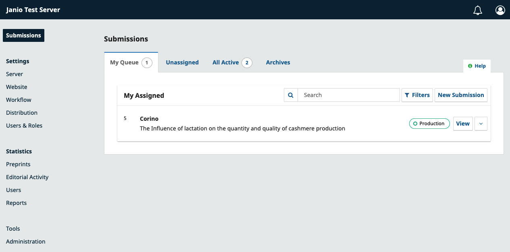
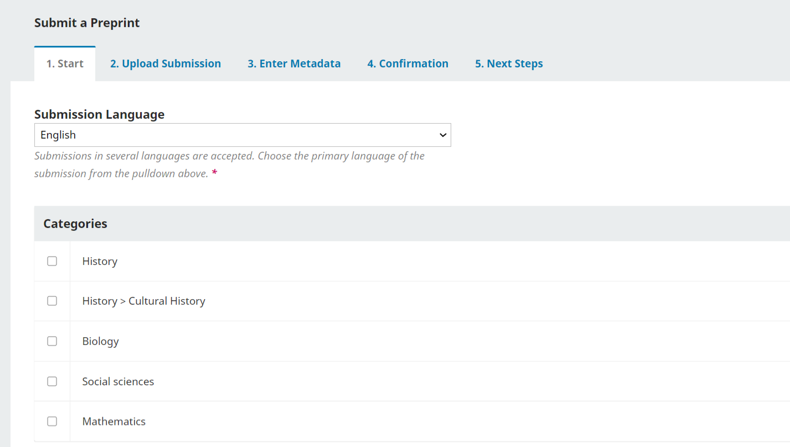
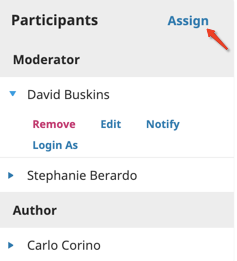
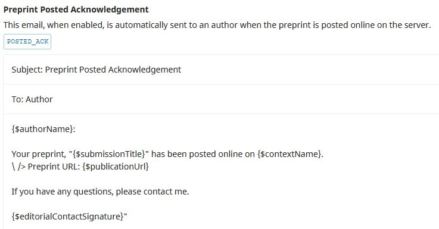
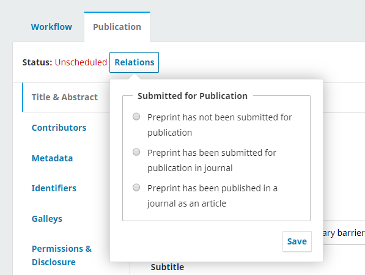
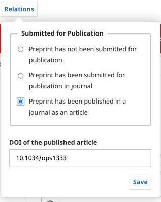
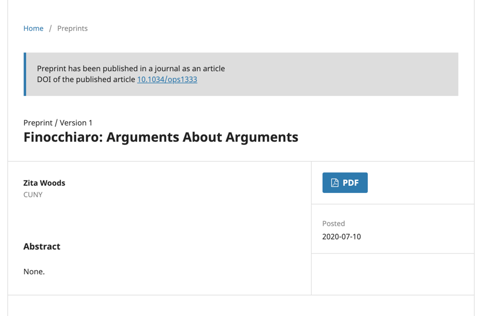

# Editorial Workflow

The editorial workflow for preprints is simple compared to the editorial workflow for journal articles. When a preprint is submitted it is immediately in the Production stage and Production is the only stage in the workflow. An activity log, similar to what is in place in OJS, indicates all of the activity that has taken place on the submission. Generally, the author has more control over the process than they would when submitting to a journal. Authors can self-post immediately upon submission, or a screening process can be used, depending on the server’s screening policy. Additionally, unlike journals, preprints are not organized into issues.

A typical workflow could be the following, with variations depending on the preprint server’s policies (see above):

1. An author makes a submission, which includes the full-text preprint file, supplemental material, and metadata.
2. The preprint is posted online automatically and immediately.
Or:
The preprint is screened by a moderator. The moderator will decide to decline the
submission or schedule it for posting.
3. Metadata is finalized and the preprint is posted online.
4. The author may post revised versions of the preprint as they become available.

This chapter explains the steps in the editorial workflow for Authors, Moderators, and Preprint Server Managers.

## Submissions Dashboard

All active and archived (published or declined) submissions for the preprint server will
appear in the Submissions dashboard.

Which submissions are visible will depend on the role of the logged in user.

* Preprint Server Managers will see all active and archived submissions.
* Moderators will see submissions that have been assigned to them.
* Authors will see their own submissions.

See [Learning OJS 3](https://docs.pkp.sfu.ca/learning-ojs/en/editorial-workflow#tasks) for further information about the Submissions dashboard and tasks.

## Making a Submission

The editorial workflow in OPS starts when an author submits a new manuscript.
How an author can make a submission is explained in [Learning OJS 3](https://docs.pkp.sfu.ca/learning-ojs/en/authoring). It is the same in OJS and OPS except that when the author makes a submission of a new preprint, they can choose a Category to submit to instead of a Section.

Depending on your preprint server policies, the preprint will be published immediately
after submission or it will be screened by a Moderator. It is also possible to have moderation done by the research community after a preprint is posted and made public.

The [Moderation and Production section](./#moderation) explains the pre-publication moderation process.

## License Selection
Following adding the contributors to a submission, authors can then assign a license of their choosing to their submission: 

The license options are the standard [Creative Commons licenses](https://creativecommons.org/licenses/), or, a URL to an alternate license can be provided. 

Once the submission is published, the license will appear alongside the preprint with the preprint’s metadata. 

## Moderation and Production

The Preprint Server Manager will receive a notification that a new submission was received
and can assign a Moderator to the submission. Or in the [Server Settings](./setup#server-settings), they can assign a Moderator to a Category or Section, which means that any new submissions to that category or section will automatically be assigned to the moderator.

If your server chooses to assign moderators to screen submissions before they are posted, you can manage, assign, and notify participants for a submission as necessary using the ‘Participants’ list.

Selecting the arrow next to a user’s name shows the list of options, which include ‘Remove’, ‘Edit’, ‘Notify’ (this option will create a new Discussion), and ‘Login As’.

It’s possible to add a new participant to the submission by selecting the ‘Assign’ button. When assigning a moderator it’s possible to allow for them to view and edit submission metadata (this option is selected by default) and/or to only recommend an editorial decision, in which case a Server Manager or another Moderator needs to record the decision to either post or decline the submission.

If the Moderator wants to ask the author a question or have a discussion with the author, another moderator, the Preprint Server Manager, or another participant in the submission, they can Add a Discussion in the Production Discussions. How to create a response to a discussion is explained in [Learning OJS 3](/learning-ojs/en/editorial-workflow#consult-with-the-author).

There are two possible editorial decisions, which are ‘Decline Submission’ or ‘Post the preprint’. Selecting ‘Decline Submission” will open a pop-up with the option to notify the author(s) or not, and selecting ‘Post the preprint’ will move the user to the Publication tab.

In OPS 3.3 it is possible to revert a 'Decline Submission' Decision. This can be done by clicking 'Change Decision' after you have recorded a Decline decision followed by Revert Decline.

## Publication

The Publication tab can be accessed at any time, not just when ‘Schedule for Publication’ is selected. This tab contains the submission’s metadata and galleys. A Galley is a final publication-ready file that has been prepared for readers and will be posted on the preprint site.

It’s important to note that the metadata and galley files for review and publication can be freely edited by both the author(s) and editorial team prior to posting.

Any publication files submitted by the author will be visible under the Galleys tab. Data sets and other supplementary files can be uploaded and published in any format in the Galleys tab, and it’s also possible to set the file label and language.

For more information on the tabs and options available, please refer to the [Publication tabs section](/learning-ojs/en/production-publication#publication-tabs) of the Learning OJS guide.

For information about managing and posting metadata in multiple languages, see [Multilingual Submissions in Learning OJS 3](/learning-ojs/en/production-publication#multilingual-submissions).

The preprint status (indicating whether it has been submitted to or published in a journal) can be altered in the dropdown menu that becomes available by selecting the ‘Relations’ button. For more information on preprint status, please refer to the [Preprint Status section](#preprint-status) in this guide.

In order to post the preprint, it’s necessary to select the ‘Schedule for Publication” button which opens a pop-up asking the user to confirm that they would like to move forward with the posting of the preprint. This will immediately release the preprint to public view.

If enabled, an email is automatically sent to the author when the preprint is posted online on the server. This automated email template can be modified, or turned off, at **Workflow Settings > Email > Email Templates**, identified with the key `POSTED_ACK`.

Once the preprint is published, the options to ‘Unpublish’ or ‘Create New Version’ become available. By unpublishing, it’s possible to edit the current version of the preprint without creating a new version, as published preprints can’t be edited while public. Adding a new version will keep the current version as is and create a new record. For more information on versioning, please refer to the [Publishing New Versions](./editorial-workflow#publishing-new-versions) section of this guide below.

### Preprint Status

There are three possible Relations statuses for a published preprint. Only the bottom two relational status will appear on the abstract page if selected.

* Preprint has not been submitted for publication;
* Preprint has been submitted for publication in a journal; or
* Preprint has been published in a journal as an article.

Submission statuses can be updated even after a Preprint has been posted, either by a Moderator or an Author. Additionally, once the preprint has had its Version of Record (VoR) published in a journal, the DOI assigned to the published preprint can be added by going to the "Relations" button and selecting the last option, that will show a text box in which the user should add the VoR’s DOI link.

Once a DOI has been entered, it will appear publicly on the Preprint abstract page.

## Publishing New Versions

Versioning is an important feature of preprint servers because it allows researchers to correct, expand, and improve their articles over time. Since preprints can change significantly between versions, it is important to post and clearly identify all versions of a preprint. OPS allows you to post different versions of an article and display all of the versions on the posted article page.

By default, only Server Managers can create new versions of a posted preprint. The **‘Create New Version’** button is available next to the **‘Unpublish’** button:

Clicking **‘Create New Version’** will open a pop-up asking if you are sure you’d like to create a new version. It’s important to note that, once a new version is created, it’s not possible to delete it; OPS allows the user to unpublish a version and create new ones, but not to delete an existing record. Note that an unpublished version of a preprint is only visible to the Server Managers and Authors.

Only once a new version is created by the Server Manager the author is allowed to edit it and add/edit metadata and galleys when they have permission to do so (for more information on this, please refer to the [“Granting Author permissions” section](./users-roles#granting-author-permissions) of this guide).

Please keep in mind that metadata that accurately and unambiguously describes the relationships between different versions should be maintained as it’s useful for helping indexing servers and reference managers deduplicate records and point readers to new versions when available.

The Server Manager can view all past and current versions of a preprint in the ‘All Versions’ button, which becomes available next to the ‘Relations’ button and the preprint Status. The current version is displayed in gray and the other versions are in blue.

For more information on versioning and editing a posted preprint, check the [Versioning of Articles](/learning-ojs/en/production-publication#versioning-of-articles) section of the Learning OJS guide.

It is currently not possible to withdraw a posted preprint. There are ongoing discussions to integrate an option for this for future release. In this case, it’s recommended that the Preprint Manager replace the existing PDF with a "placeholder" PDF indicating that it has been withdrawn and the reason.

In the future, it should be possible for authors to submit their posted preprints for publication in a journal via OPS, using the [SWORD protocol](https://sword.cottagelabs.com/).
