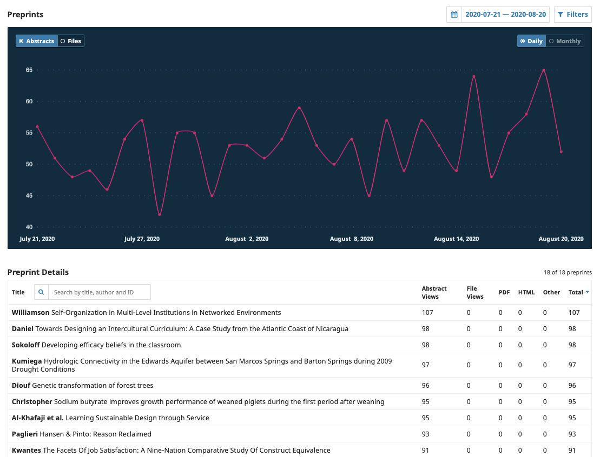
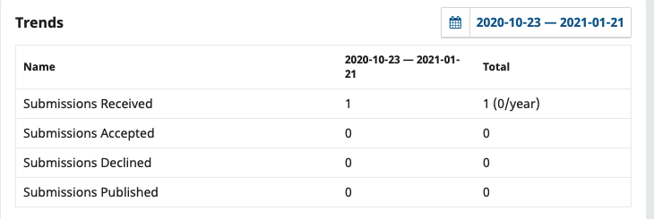

# Statistics

This chapter of Learning OPS provides a general overview of statistics available in Open Preprint Server (OPS). For more detailed information on statistics and usage guidelines, please see the Statistics chapter on the [Learning OJS](/learning-ojs/en/statistics).

There are a number of identified improvements that will be made towards statistics specific to Server Preprints for future releases.

## Preprints

The Preprints section provides a visual display as well as a table format of preprint activity.  The visual graphic can be changed from Monthly or Daily view. While the table format will allow you to filter the Total in ascending or descending order. As well as changed to view Abstract and File activity.

There are also a number of filters that can be used including date range and section. The search bar under Preprint Details can be used to search for the activity of a specific preprint manuscript.

### Geographical and Institutional Statistics

When Geographical and Institutional Statistics have been enabled (see the [Administrator's Guide](https://docs.pkp.sfu.ca/admin-guide/en/statistics) for details), OPS can collect data about the readers' locations and institutions for statistical reporting. To access these reports, click "Download Report" and choose the report you wish to access.

This information is also available via the COUNTER SUSHI interface. See the [Administrator's Guide](https://docs.pkp.sfu.ca/admin-guide/en/statistics#counter) for details.

## Editorial Activity

The Editorial activity statistics provides a visual graph and trend table with a summary of the editorial activity for your Server. This can be filtered for a specific date range.

## Users

Provides a summary of the number of users registered in your server and by roles.

## Reports

The Reports page provides access to a variety of reports from your preprint server. The list may be expanded by installing additional plugins. For information on how to use and configure statistics in OPS, see the relevant section in [Learning OJS](/learning-ojs/en/statistics#reports).
